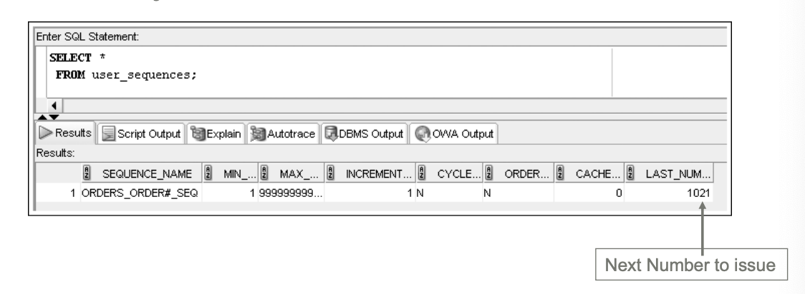
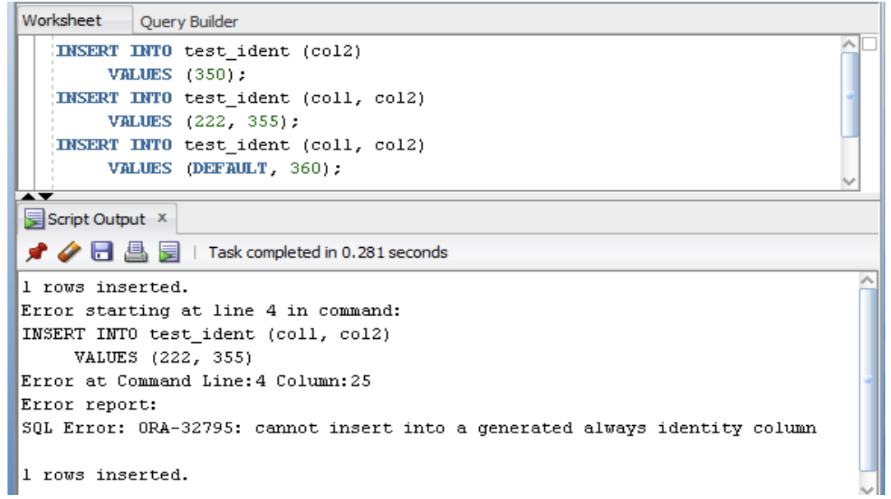
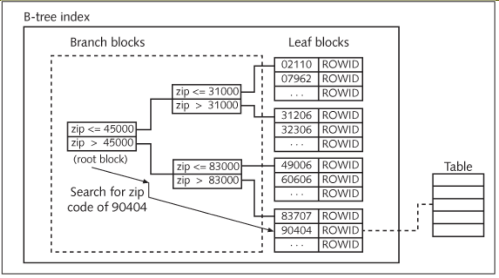
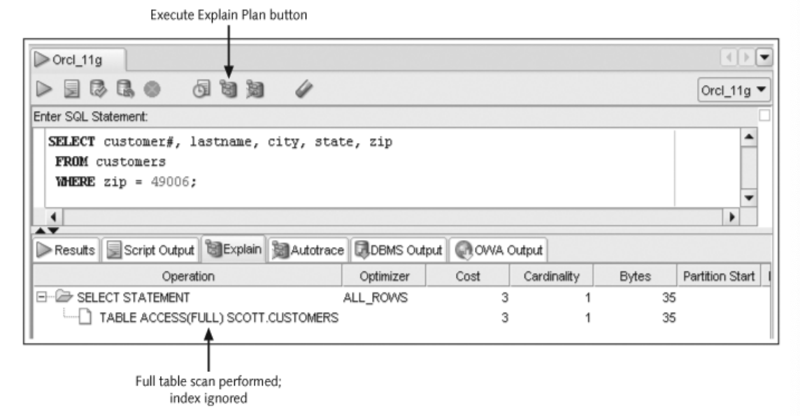
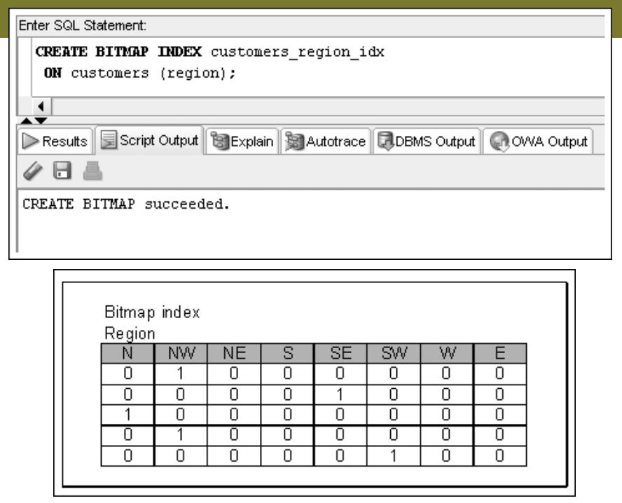
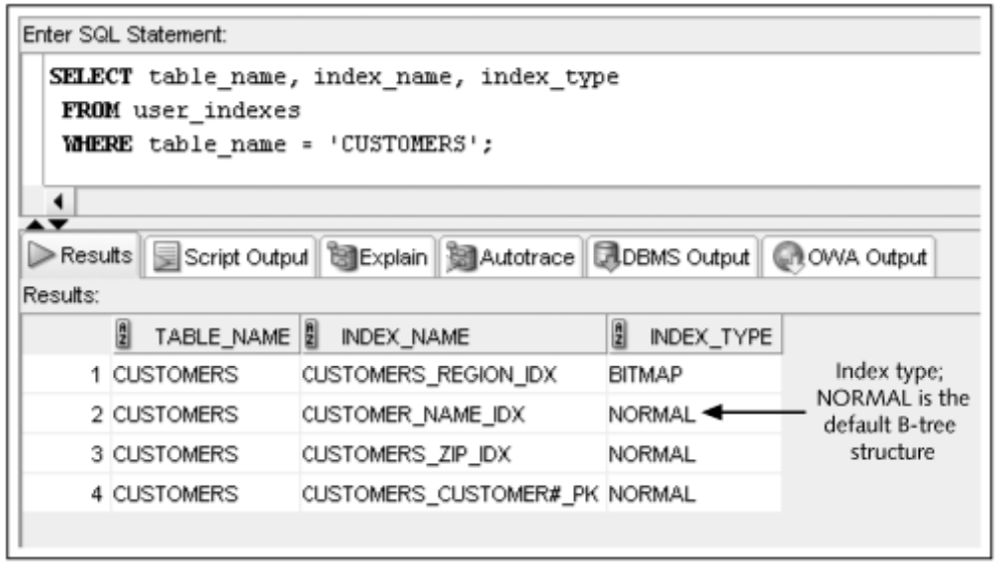
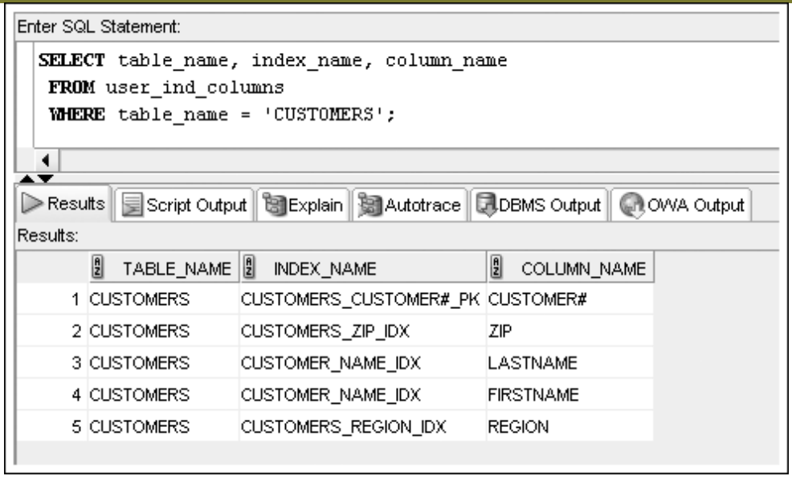



📋 This is my note-taking from what I learned in the class "Advanced Database Concepts"


<div class="notice--danger">{{ notice-2 | markdownify }}</div>

<!-- 📋 This is my note-taking from what I learned in the LinkedIn Learning course "Explore a Career in SQL Development"
{: .notice--danger} -->

<br>

# Objective

- Define the purpose of a sequence and state how it can be used in a database
- Explain why gaps may appear in the integers generated by a sequence
- Use the CREATE SEQUENCE command to create a sequence
- Call and use sequence values
- Identify which options cannot be changed by the ALTER SEQUENCE command
- Delete a sequence
- Create indexes with the CREATE INDEX command
- Explain the main index structures: B-tree and bitmap
- Verify index use with the explain plan
- Introduce variations on conventional indexes, including a function-based index and an index organized table
- Verify index existence via the data dictionary
- Rename an index with the ALTER INDEX command
- Remove an index using the DELETE INDEX command
- Create and remove a public synonym

<br>

# Database Objects

- An object is anything that has a name and defined structure
  : - Table: Stores data
  : - Sequence: Generates sequential integers
  : - Index: Allows users to quickly locate specific records
  : - Synonym: Alias for other database objects

<br>

# Sequences

- Used for internal control purposes by providing sequential integers for auditing
- Used to generate unique value for primary key column
  : Surrogate key = No correlation with actual row contents

<br>

# Creating a Sequence

- Use the `CREATE SEQUENCE` command
- Various intervals are allowed
  : Default: 1
- You can specify the starting number
  : Default: 1

```
CREATE SEQUENCE sequencename
[INCREMENT BY value]
[START WITH value]
[{MAXVALUE value | NOMAXVALUE}]
[{MINVALUE value | NOMINVALUE}]
[{CYCLE | NOCYCLE}]
[{ORDER | NOORDER}]
[{CACHE value | NOCACHE}];
```

- Can specify `MINVALUE` for decreasing sequence and `MAXVALUE` for increasing sequence
- Numbers can be reused if `CYCLE` is specified
- `ORDER` clause is used in application cluster environment
  : The order clause guarantees that the sequence's next value is the next one in line, no matter the instance that received the request
- Use `CACHE` to pregenerate integers - Default: 20

```
CREATE SEQUENCE orders_order#_seq
  INCREMENT BY 1
  START WITH 1021
  NOCACHE
  NOCYCLE;

-- CREATE SEQUENCE succeeded
```

- To verify the settings for options of a sequence, query `USER_SEQUENCES` data dictionary view

```
SELECT * FROM user_sequences;
```



<br>

# Using Sequence Values

- `NEXTVAL` - Generates integer

```
INSERT INTO orders (order#, customer#, orderdate, shipdate, shipstreet, shipcity, shipstate, shipzip)
  VALUES (orders_order#_seq.NEXTVAL, 1010, '06-APR-09', NULL, '123 WEST MAIN', 'ATLANTA', 'GA', 30418);

-- 1 rows inserted
```

- `CURRVAL` - Contains last integer generated by `NEXTVAL`

```
INSERT INTO orders (order#, customer#, orderdate, shipdate, shipstreet, shipcity, shipstate, shipzip)
  VALUES (orders_order#_seq.CURRVAL, 1010, '06-APR-09', NULL, '123 WEST MAIN', 'ATLANTA', 'GA', 30418);

-- 1 rows inserted
```

- Set Column `DEFAULT` value

```
CREATE SEQUENCE test_defval_seq
  INCREMENT BY 1
  START WITH 100
  NOCACHE
  NOCYCLE;

CREATE TABLE test_defval
  (col1 NUMBER DEFAULT test_defval_seq.NEXTVAL,
   col2 NUMBER);

-- sequence TEST_DEFVAL_SEQ created.
-- table TEST_DEFVAL created.
```

<br>

# Altering Sequence Definitions

- Use `ALTER SEQUENCE` command to change the settings for a sequence
- `START WITH` value cannot be altered - Drop the sequence and re-create it
- Changes cannot make current integers invalid

<br>

# ALTER SEQUENCE Command Example

```
ALTER SEQUENCE orders_order#_seq
  INCREMENT BY 10;

-- ALTER SEQUENCE orders_order#_seq succeeded.
```

<br>

# Removing a Sequence

- Use the `DROP SEQUENCE` command to delete a sequence
- Previous values generated are not affected by removing a sequence from a database

```
DROP SEQUENCE orders_order#_seq;

-- DROP SEQUENCE orders_order#_seq succeeded.
```

<br>

# Create an Identity Column

- Alternative to using sequences to populate primary key columns

```
CREATE TABLE test_ident
  (col1 NUMBER GENERATED AS IDENTITY PRIMARY KEY,
   col2 NUMBER);

-- table TEST_IDENT created.
```

<br>

# Using an Identity Column

```
INSERT INTO test_ident (col2)
  VALUES (350);
INSERT INTO test_ident (col1, col2)
  VALUES (222, 355);
INSERT INTO test_ident (col1, col2)
  VALUES (DEFAULT, 360);
```



<br>

# Indexes

- An index stores frequently referenced values and `ROWIDs`
- Can be based on one column, multiple columns, functions, or expressions

<br>

# B-Tree Index



- Implicitly create an index by `PRIMARY KEY` and `UNIQUE` constraints
- Explicitly create an index by using the `CREATE INDEX` command

<br>

# CREATE INDEX Command Examples

```
CREATE INDEX customers_zip_idx
  ON customers (zip);

-- CREATE INDEX succeeded.
```

```
CREATE INDEX customer_name_idx
  ON customers (lastname, firstname);

-- CREATE INDEX succeeded.
```

<br>

# The Explain Plan



<br>

# Bitmap Indexes

```
CREATE BITMAP INDEX customers_region_idx
  ON customers (region);

-- CREATE BITMAP succeeded.
```



<br>

# Function-Based Indexes

```
CREATE INDEX books_profit_idx
  ON books (retail - cost);

-- CREATE INDEX succeeded.
```

```
CREATE INDEX orders_shipdate_idx
  ON orders (NVL(shipdate, 'null'));
```

<br>

# Index Organized Tables

- An IOT stores table contents in a B-Tree index structure
- Use the `ORGANIZATION INDEX` option in a `CREATE TABLE` statement to build an IOT

```
CREATE TABLE books2
  (ISBN VARCHAR2(10),
   title VARCHAR2(30),
   pubdate DATE,
   pubID NUMBER(2),
   cost NUMBER(5,2),
   retail NUMBER(5,2),
   category VARCHAR2(12),
    CONSTRAINT books2_isbn_pk PRIMARY KEY(isbn))
   ORGANIZATION INDEX;
```

<br>

# Verifying an Index

- Use the `USER_INDEXES` data dictionary view to determine that the index exists
- Use the `USER_IND_COLUMNS` data dictionary view to determine the column index information

```
SELECT table_name, index_name, index_type
  FROM user_indexes
  WHERE table_name = 'CUSTOMERS';
```



<br>

# USER_IND_COLUMNS

```
SELECT table_name, index_name, column_name
  FROM user_ind_columns
  WHERE table_name = 'CUSTOMERS';
```



<br>

# Removing an Index

- Use the `DROP INDEX` command to remove an index

```
DROP INDEX books_profitcalc_idx;

-- DROP INDEX books_profitcalc_idx succeeded.
```

<br>

# Synonyms

- Synonyms serve as permanent aliases for database objects
- Simplify object references
- Can be private or public
  : - Private synonyms are only available to the user who created them
  : - PUBLIC synonyms are available to all database users

<br>

# CREATE SYNONYM Command Syntax

```
CREATE [PUBLIC] SYNONYM synonymname
  FOR objectname;
```

<br>

# CREATE SYNONYM Command

```
CREATE SYNONYM orderentry
  FOR orders;

-- CREATE SYNONYM succeeded.
```


<br>

# Deleting a SYNONYM

- A private synonym can be deleted by its owner
- A PUBLIC synonym can only be deleted by a user with DBA privileges

```
DROP [PUBLIC] SYNONYM synonymname;
```

```
DROP SYNONYM orderentry;

-- DROP SYNONYM orderentry succeeded.
```

<br>

# Summary

- A sequence can be created to generate a series of integers
- The values generated by a sequence can be stored in any table
- A sequence is created with the CREATE SEQUENCE command
- Gaps in sequences might occur if the values are stored in various tables, if numbers are cached but not used, or if a rollback occurs
- A value is generated by using the NEXTVAL pseudocolumn
- The CURRVAL pseudocolumn is NULL until a value is generated by NEXTVAL
- The USER_OBJECTS data dictionary object can be used to confirm the existence of all schema objects
- The USER_SEQUENCES data dictionary object is used to view sequence settings
- A sequence may be set as a column DEFAULT value
- An identity column can be created to manage primary key population as an alternative to using sequences
- The ALTER SEQUENCE command is used to modify an existing sequence; the only settings that can’t be modified are the START WITH option and any option that would be invalid because of previously generated values
- The DUAL table is helpful for testing sequence value generation
- The DROP SEQUENCE command deletes an existing sequence
- An index can be created to speed up the query process
- DML operations are always slower when indexes exist
- Oracle 11g creates an index for PRIMARY KEY and UNIQUE constraints automatically
- An explicit index is created with the CREATE INDEX command
- An index can be used by Oracle 11g automatically if a query criterion or sort operation is based on a column or an expression used to create the index
- The two main structures for indexes are B-tree and bitmap
- The explain plan can verify whether an index is used in a query
- Function-based indexes are used to index an expression or the use of functions on a column or columns
- An index organized table is a table stored in a B-tree structure to combine the index and table into one database object
- Information about an index can be retrieved from the USER_INDEXES and USER_IND_COLUMNS views
- An index can be dropped with the DROP INDEX command
- An index can be renamed with the ALTER INDEX command
- Except for a name change, an index can’t be modified; it must be deleted and then re-created
- A synonym provides a permanent alias for a database object
- A public synonym is available to any database user
- A private synonym is available only to the user who created it
- A synonym is created by using the CREATE SYNONYM command
- A synonym is deleted by using the DROP SYNONYM command
- Only a user with DBA privileges can drop a public synonym

<br>

---

<br>

[Back to Top](#){: .btn .btn--primary }{: .align-right}
