

📋 This is my note-taking from what I learned in the class "Advanced Database Concepts"


<div class="notice--danger">{{ notice-2 | markdownify }}</div>

<!-- 📋 This is my note-taking from what I learned in the LinkedIn Learning course "Explore a Career in SQL Development"
{: .notice--danger} -->

<br>

# Objective

- PL/SQL and application programming
- Application models
- How to locate Oracle resources
- SQL and PL/SQL tools
- The databases used in this book
- SQL SELECT statement and data manipulation syntax

<br>

# Procedural Languages

- Programming languages allow actions of the end user to be converted to computer instructions
- Procedural languages allow the inclusion of logic processes
- PL/SQL is a procedural language, SQL is not a procedural language

<br>

# Application Programming

Example application screen

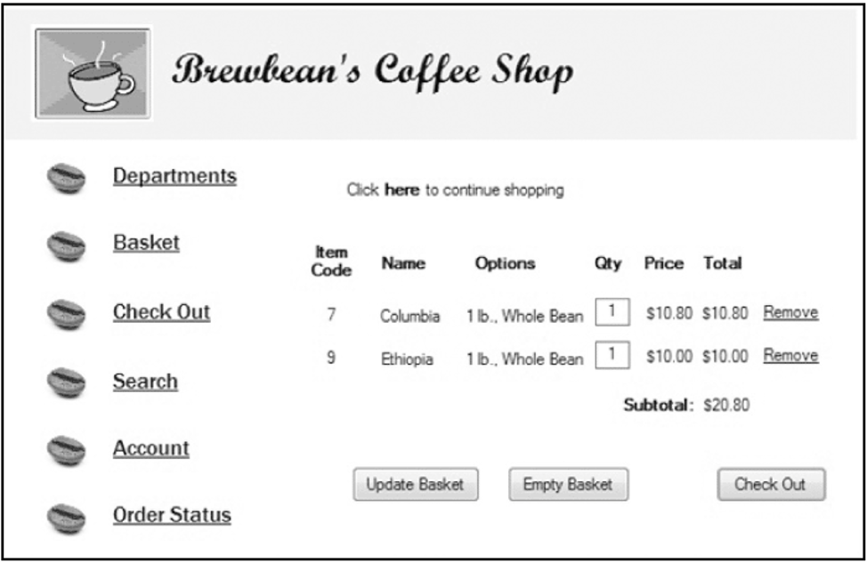

<br>

# Brewbean’s Application

Processing needed to support the shopping cart check out button:

- Verify quantities are > 0
- Calculate shipping cost
- Calculate taxes
- Check/update product inventory
- Check shopper profile for credit card information

<br>

# The PL/SQL Language

- Proprietary Oracle language
- Tightly integrated with SQL
- Can increase performance by grouping statements into blocks of code
- Portable to any Oracle platform
- Used within many Oracle tools
- Stored program units can increase security

<br>

# Application Models

- Three main components
  : - User interface or screens
  : - Program logic (brains behind the screens)
  : - Database
- Most models are based on a two- or three-tier structure

<br>

# Two-tier Model

- Commonly referred to as client/server
- Parts of the processing occur both on the user’s computer and the database server
- Named or stored program units are blocks of PL/SQL code saved in the Oracle database to provide server-side processing

<br>

# Two-tier Diagram

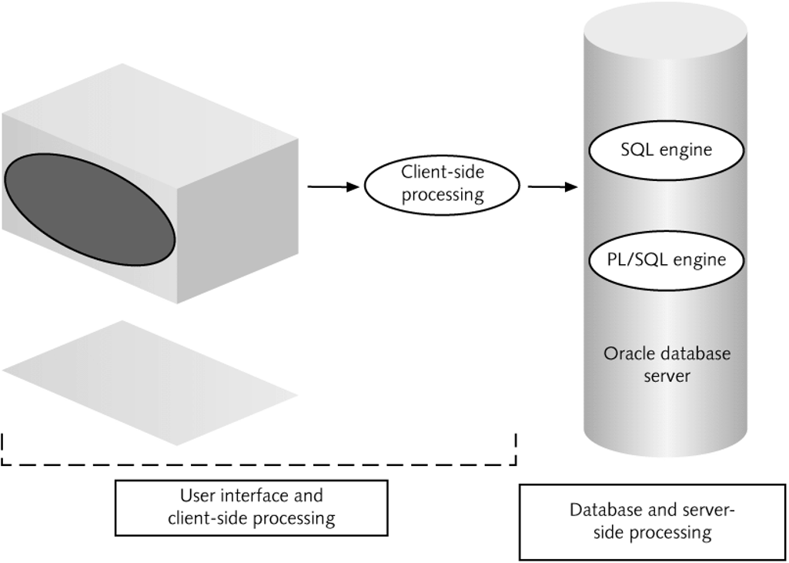

<br>

# Three-tier Model

- Thin client with no code loaded on the user machine (browser access)
- Middle tier is the application server – Forms server for Oracle
- Last tier is the database server
- Processing load is on the middle and last tier
- Maintenance is simplified

<br>

# Three-tier Diagram

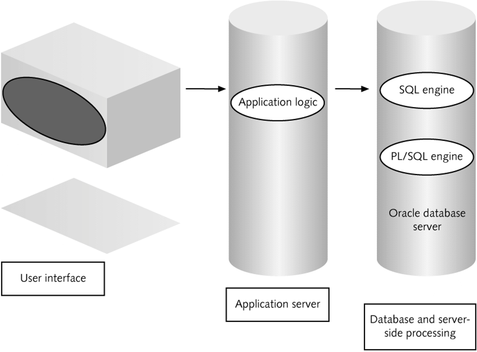

<br>

# Oracle Documentation

- Oracle Technology Network (OTN): otn.oracle.com
  : - Documentation
  : - Sample Code
  : - Discussion Forums
- User Web sites: PL/SQL Obsession

<br>

# SQL & PL/SQL Tools

- SQL\*Plus
- SQL Developer
  : - Appendix B
- Other software introduced in appendices
  : - TOAD
  : - SQL Navigator

<br>

# SQL\*Plus Client Interface

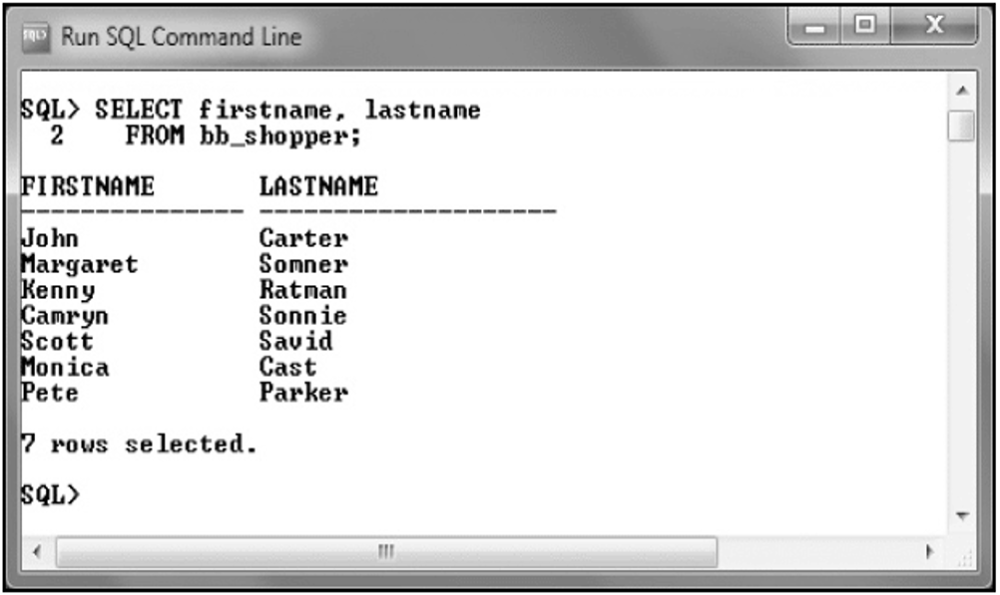

<br>

# SQL Developer


<br>

# Databases Used

- Brewbean’s Company
  : - In text examples
  : - Assignments
- DoGood Donor
  : - Assignments
- More Movie Rentals
  : - Case Projects

<br>

# The Brewbean’s Company

- Retails coffee and brewing equipment via the Internet, phone, and stores
- Used in chapter explanations, examples, and exercises
- Databases create script provided for each chapter

<br>

# ERD for Brewbean’s DB


<br>

# DoGood Donor ERD

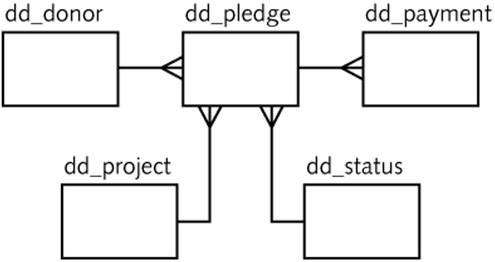

<br>

# More Movies ERD

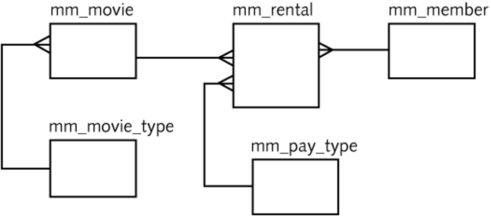

<br>

# SQL Query Syntax

```
SELECT <columns>
	FROM <tables, views>
	WHERE <conditions>
	GROUP BY <columns>
	HAVING <aggregation conditions>
	ORDER BY <columns>;
```

<br>

# Traditional Join

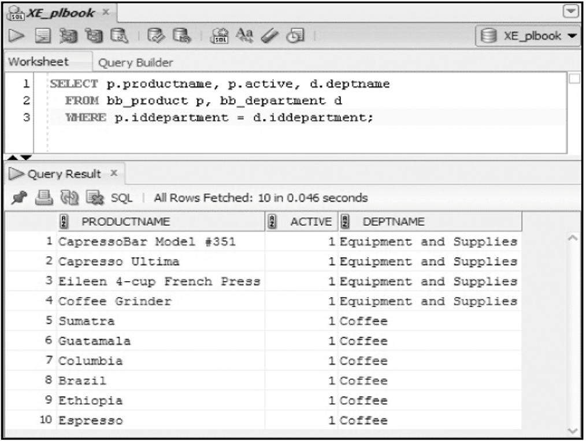

<br>

# ANSI Join

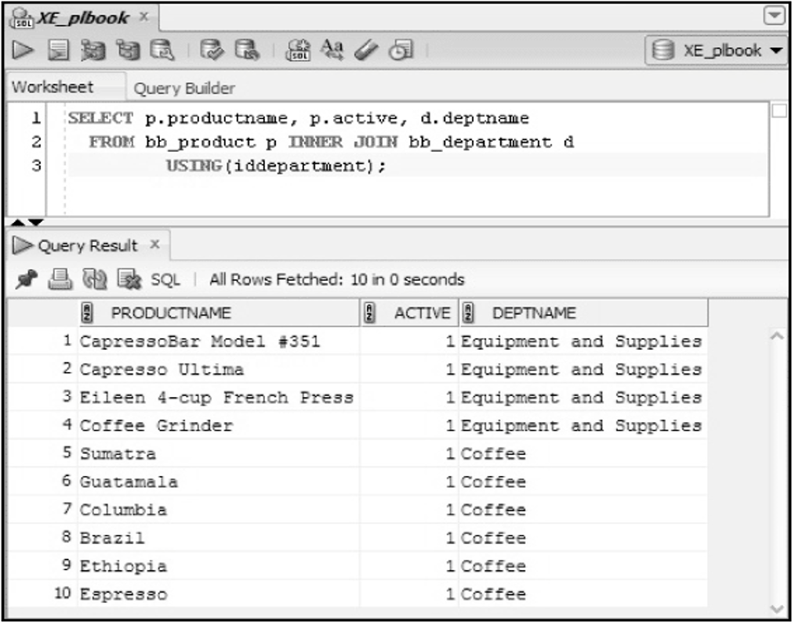

<br>

# Aggregate function

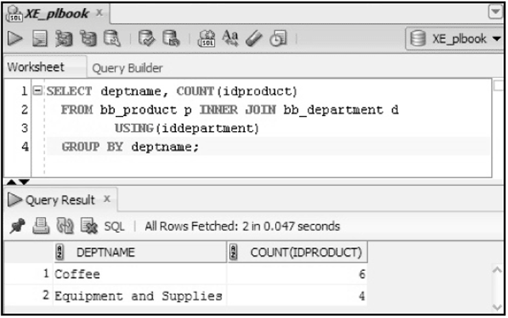

<br>

# WHERE clause filter

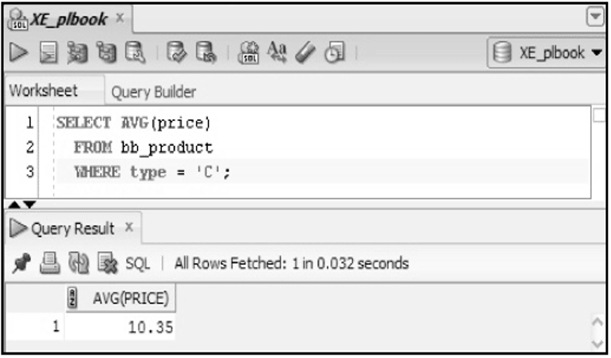

<br>

# Creating Tables

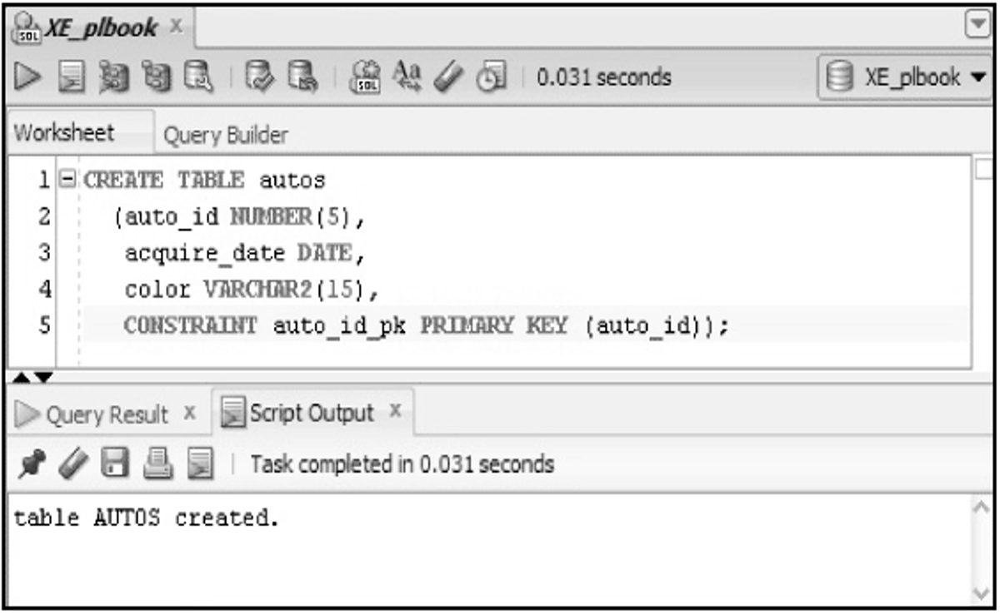

<br>

# DML - Insert

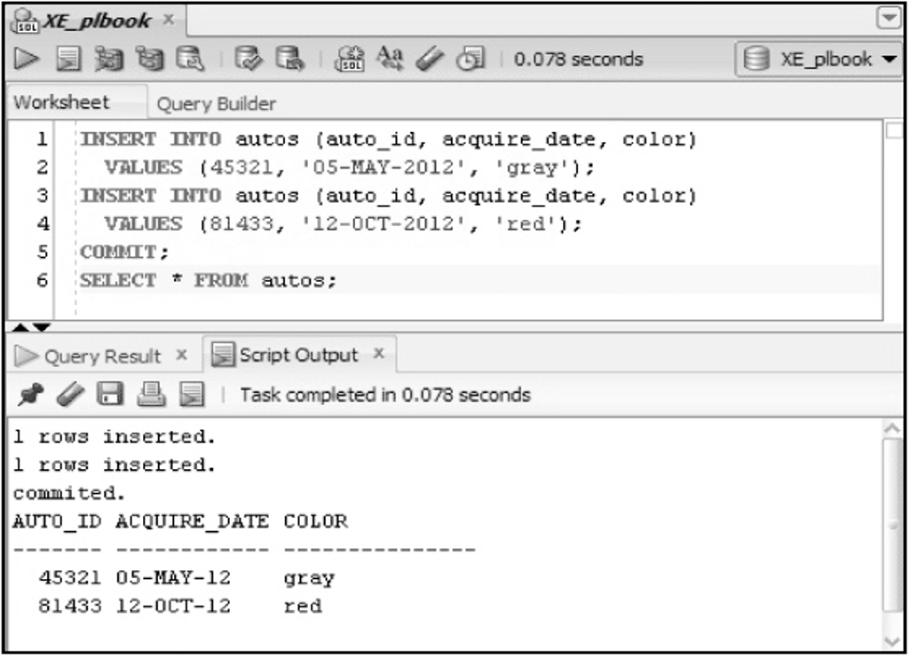

<br>

# DML - Update

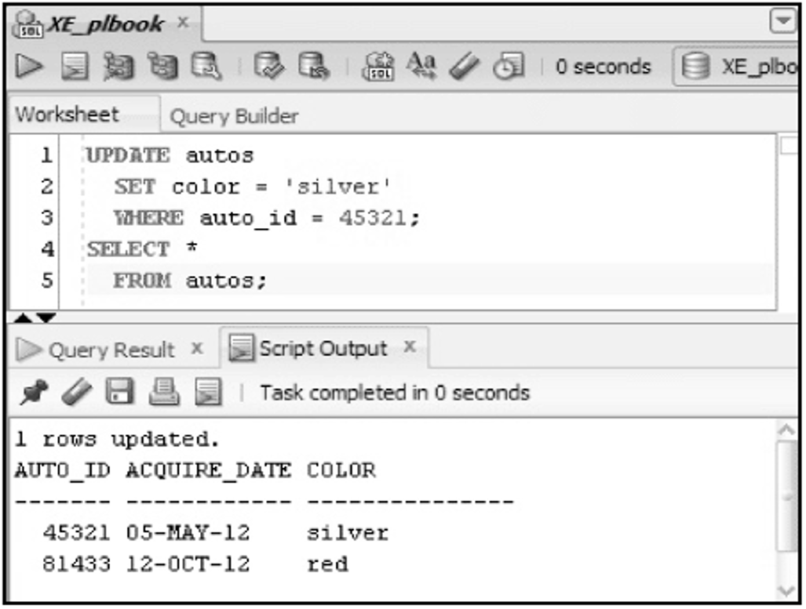

<br>

# DML - Delete

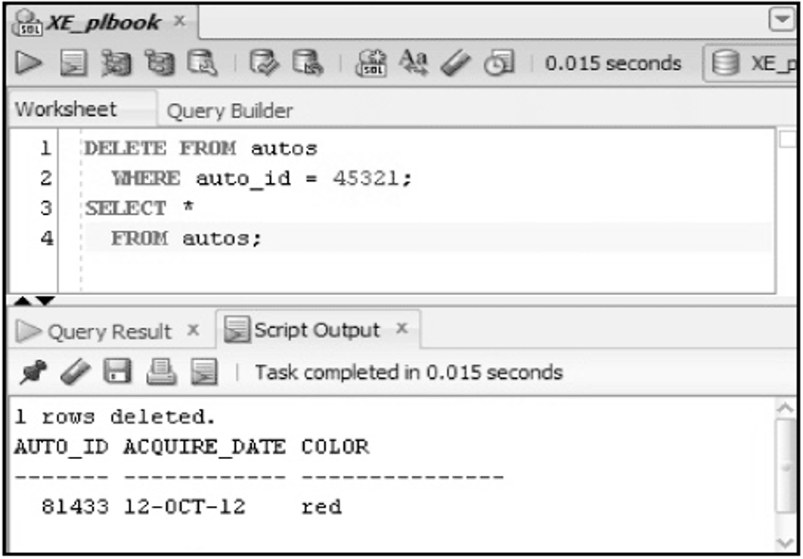

<br>

# Drop Table

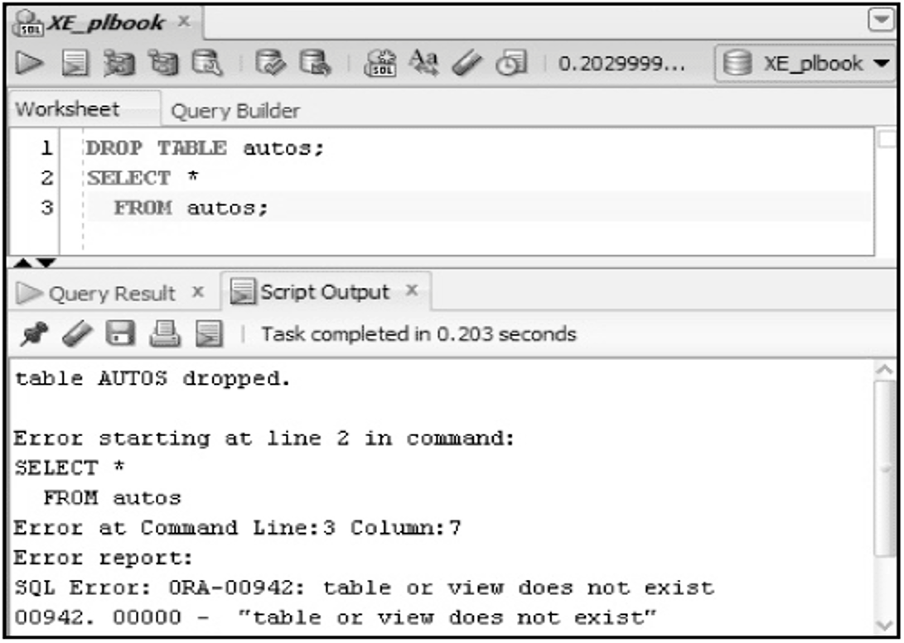

<br>

---

<br>

[Back to Top](#){: .btn .btn--primary }{: .align-right}
