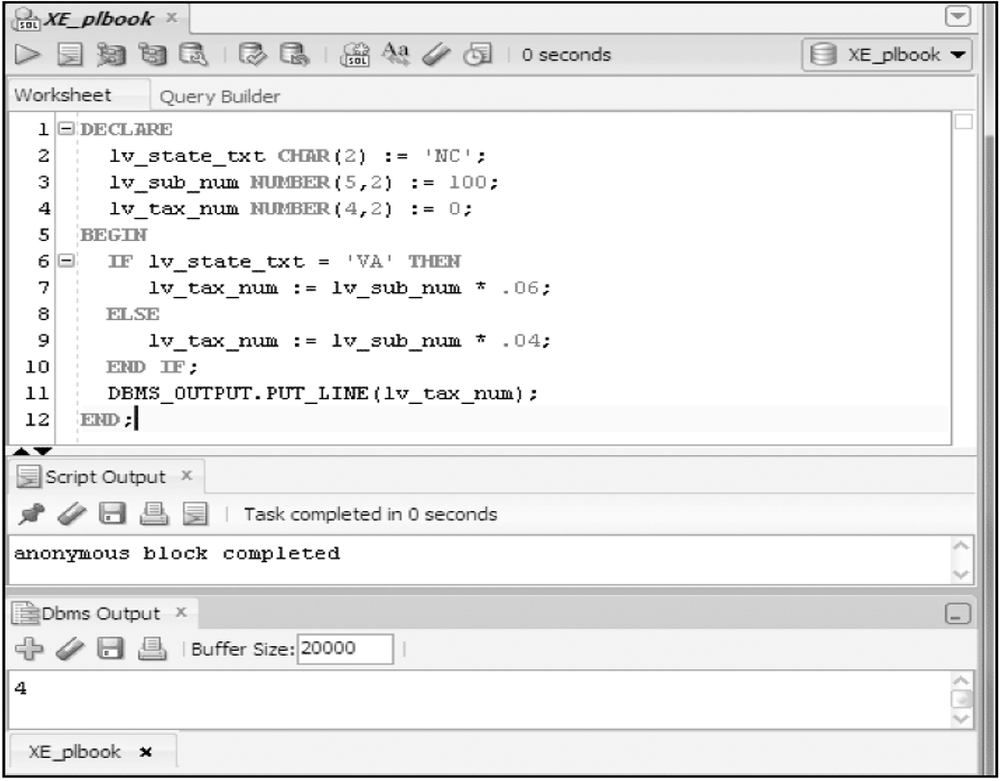
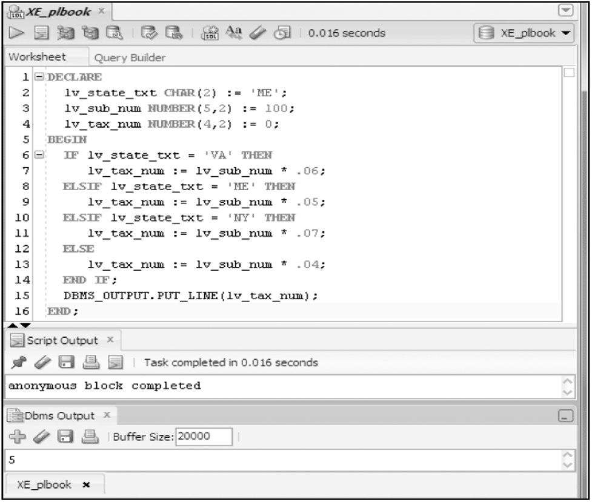



📋 This is my note-taking from what I learned in the class "Advanced Database Concepts"


<div class="notice--danger">{{ notice-2 | markdownify }}</div>

<!-- 📋 This is my note-taking from what I learned in the LinkedIn Learning course "Explore a Career in SQL Development"
{: .notice--danger} -->

<br>

# Objective

- Programming fundamentals
- PL/SQL blocks
- How to define and declare variables
- How to initialize and manage variable values
- The NOT NULL and CONSTANT variable options
- How to perform calculations with variables
- The use of SQL single-row functions in PL/SQL statements
- Decision structures: IF-THEN and CASE
- Looping actions: basic, FOR and WHILE
- CONTINUE statements
- Nested Statements

<br>

# Program Logic Flow

- Identify sequence of actions needed prior to coding
- Use a flowchart to visually represent the sequence of actions

<br>

# Flowcharting - Search for Coffee Products


<br>

# Decision Structures


<br>

# Looping Structures


<br>

# PL/SQL Block Questions

- What is a block?
- What are the different segments of a block?
- How does data get into a block?
- How are different data types handled?

<br>

# Brewbean’s Challenge


<br>

# PL/SQL Block Structure

- DECLARE – create variables, cursors, and types
- BEGIN – SQL, logic, loops, assignment statements
- EXCEPTION – error handling
- END – close the block

<br>

# Variable Names

- Begin with alpha character
- Up to 30 characters
- Can contain upper and lowercase letters, numbers, `_`, `$`, `#`

<br>

# Scalar Variable Data Types

- Character
  : - CHAR(n)
  : - VARCHAR2(n)
- Numeric
  : - NUMBER(p,s)
- Date
  : - DATE
- Boolean
  : - BOOLEAN

Note: Only holds a single value

<br>

# Example Scalar Declarations

```
DECLARE
  lv_ord_date DATE;
  lv_last_txt VARCHAR2(25);
  lv_qty_num NUMBER(2);
  lv_shipflag_bln BOOLEAN;
BEGIN
 ---- PL/SQL executable statements ----
END;
```

Note: Minimum requirements are variable name and data type

<br>

# Test Variables


<br>

# Variable Initialization

- Set a variable value when the variable is created

```
DECLARE
  lv_ord_date DATE := SYSDATE;
  lv_last_txt VARCHAR2(25) := 'Unknown';
  lv_qty_num NUMBER(2) := 0;
  lv_shipflag_bln BOOLEAN := FALSE;
BEGIN
 ---- PL/SQL executable statements ----
END;
```

<br>

# Test Variable Initialization


<br>

# Variable Declaration Options

- NOT NULL – the variable must always contain a value
- CONSTANT – the variable value can not be changed in the block

```
DECLARE
  lv_shipcntry_txt VARCHAR2(15) NOT NULL := 'US';
  lv_taxrate_num CONSTANT NUMBER(2,2) := .06;
BEGIN
 ---- PL/SQL executable statements ----
END;
```

<br>

# Calculations with Scalar Variables


<br>

# Using SQL Functions


<br>

# Decision Structures

- Control which statements in a PL/SQL block will execute
- Enables conditions to be tested to determine the flow of statement execution
- Most programming languages provide IF and CASE statements to enable conditional processing
- IF Statements
  : - Simple IF
  : - IF/THEN/ELSE
  : - IF/THEN/ELSIF/ELSE
- CASE Statements
  : - Basic CASE statement
  : - Searched CASE statement
  : - CASE expression

<br>

# Basic IF Statement


<br>

# IF/THEN/ELSE



<br>

# IF/THEN/ELSIF/ELSE



<br>

# Nested IF

```
IF lv_type_txt = 'E' THEN
    IF lv_price_num > 85 THEN # Inner or nested IF begins
       lv_disc_num = .20;
    ELSIF lv_price_num > 45 THEN
       lv_disc_num = .15;
    ELSE
       lv_disc_num = .10;
    END IF; # Inner or nested IF ends
ELSIF lv_type_txt = 'C' THEN
    lv_disc_num = .05;
END IF;
```

<br>

# Logical Operators within IF

Logical operators (AND, OR) enable multiple conditions to be checked

```
IF lv_state_txt = 'VA' OR lv_state_txt = 'PA' THEN
  lv_tax_num := lv_sub_num * .06;
ELSE
  lv_tax_num := lv_sub_num * .04;
END IF;
```

<br>

# Basic CASE Statement


<br>

# Searched CASE


<br>

# CASE Expression


<br>

# Looping

- Enables a statement or set of statements to be executed more than once
- A loop must provide instructions of when to end the looping, or an ‘infinite’ loop will be produced

<br>

# Basic LOOP


<br>

# WHILE Loop


<br>

# FOR Loop


<br>

# CONTINUE Statement


<br>

# Nested Loops


<br>

# Summary

- A flowchart assists in laying out processing logic
- A PL/SQL block contains a DECLARE, BEGIN, EXCEPTION, and END sections
- Variables to hold values are declared
- Scalar variables hold a single data value
- Scalar variables can hold string values, numbers, dates, and - Boolean values
- DBMS_OUTPUT.PUT_LINE is used to display values
- IF statement structure is IF/THEN/ELSIF/ELSE
- CASE statements provide decision processing similar to IF statements
- Looping structures include: basic, WHILE, and FOR
- Host or bind variables can be used to interact with the application environment

<br>

---

<br>

[Back to Top](#){: .btn .btn--primary }{: .align-right}
