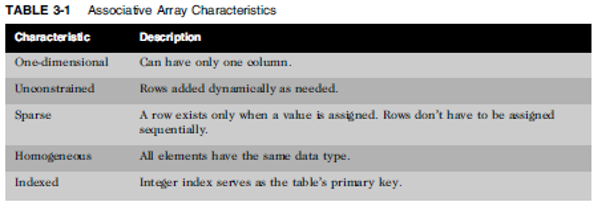



📋 This is my note-taking from what I learned in the class "Advanced Database Concepts"


<div class="notice--danger">{{ notice-2 | markdownify }}</div>

<!-- 📋 This is my note-taking from what I learned in the LinkedIn Learning course "Explore a Career in SQL Development"
{: .notice--danger} -->

<br>

# Objective

- SQL queries in PL/SQL
- The %TYPE attribute
- Expanding block processing to include queries and control structures
- Embedding DML statements in PL/SQL
- Using record variables
- Creating collections
- Bulk processing basics
- GOTO statement

<br>

# Brewbean’s Challenge

Consider actions needed upon check out


<br>

# Include SQL within a Block

Data query needs to identify if the customer has a saved basket


- SQL statements can be embedded into the executable area of a PL/SQL block
- SELECT statements are embedded to query needed data
- An INTO clause is added to a SELECT statement to move data retrieved into variables

.png>)

<br>

# Executing a Block with Errors

Common Errors

- Use = rather than `:=`
- Not declaring a variable
- Misspelling a variable name
- Not ending a statement with `;`
- No data returned from a SELECT statement
- Not closing a statement with `;`
  : 

<br>

# %TYPE Attribute

- Use in variable declaration to provide data type based on a table column
- Ideal for declaring variables that will hold data from the database
- Minimizes maintenance by avoiding program changes to reflect database column changes
- Called an anchored data type

```
lv_basket_num bb_basket.idBasket%TYPE;
```

<br>

# Data Retrieval with Decision Structures


<br>

# IF Statement Example


<br>

# Including DML

- DML statements can be embedded into PL/SQL blocks to accomplish data changes
- DML includes INSERT, UPDATE, and DELETE statements
- Add a new shopper - INSERT
  : .png>)

<br>

# Record variables

- Stores multiple values of different data types as one unit
- Record – can hold one row of data

<br>

# Record Data Type


<br>

# %ROWTYPE Attribute

Create record structure based on table structure

```
DECLARE

rec_shopper bb_shopper%ROWTYPE;

BEGIN

SELECT *
INTO rec_shopper
FROM bb_shopper
WHERE idshopper = 25;

DBMS_OUTPUT.PUT_LINE(rec_shopper.lastname);
DBMS_OUTPUT.PUT_LINE(rec_shopper.address);
DBMS_OUTPUT.PUT_LINE(rec_shopper.email);
END;
```

<br>

# INSERT Using Record


<br>

# Collections

- Store multiple values of the same data type
- Similar to arrays in other languages
- Associative Array– handle many rows of one field



<br>

# Associative Array Attributes


<br>

# Associative Array Example


.png>)

<br>

# Table of Records

- Contains one or more records
- Handle shopping basket data


<br>

# Bulk Processing

- Improve performance & add capabilities
- Reduces context switching
- Groups SQL actions for processing
- BULK COLLECT and FORALL statements
- Enables loading multi-row query directly to table of record variable
  : 

<br>

# GOTO Statement

- Jumping control that instructs the program to move to another area of code to continue processing
- Most developers discourage the use of GOTO as it complicates the flow of execution

<br>

# Summary

- SQL queries and DML statements can be embedded into a block
- An INTO clause must be added to a SELECT
- The %TYPE attribute is used to use a column data type
- Composite data types can hold multiple values in a single variable
- A record can hold a row of data
- A table of records can hold multiple rows of data
- The %ROWTYPE attribute can be used to declare a data type based on a table’s structure
- An associative array is a collection of same type data
- Bulk processing groups SQL statements for processing to improve performance
- The GOTO statement enables execution to jump to specific portions of code

<br>

---

<br>

[Back to Top](#){: .btn .btn--primary }{: .align-right}
