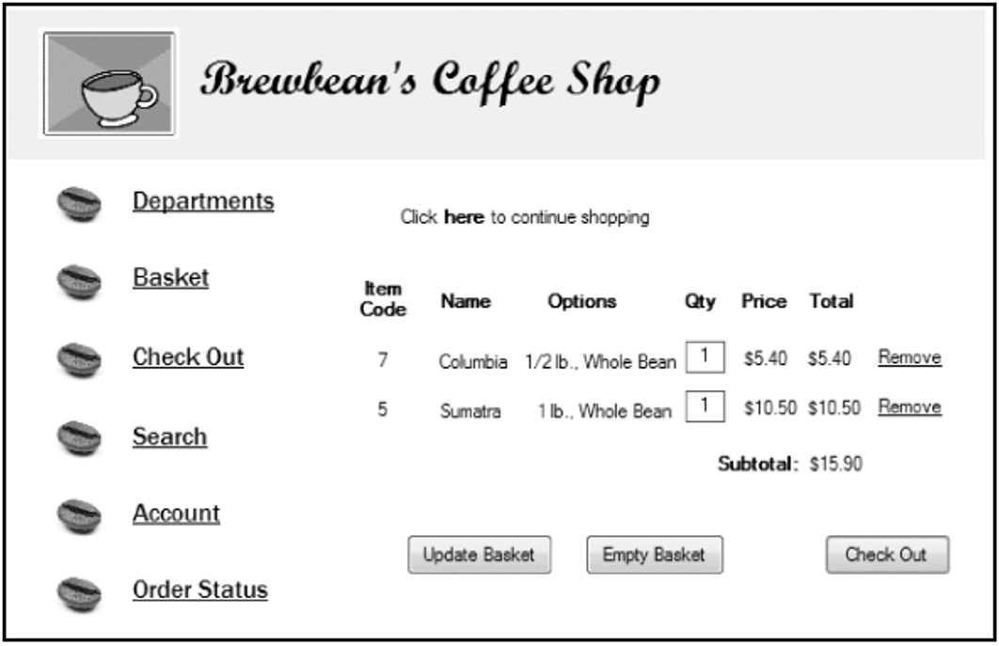
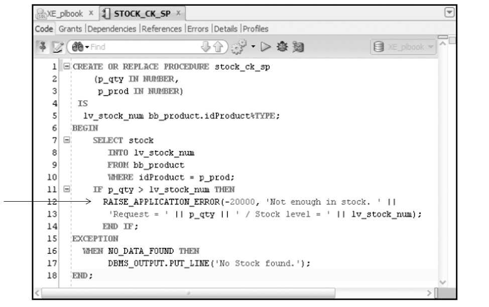
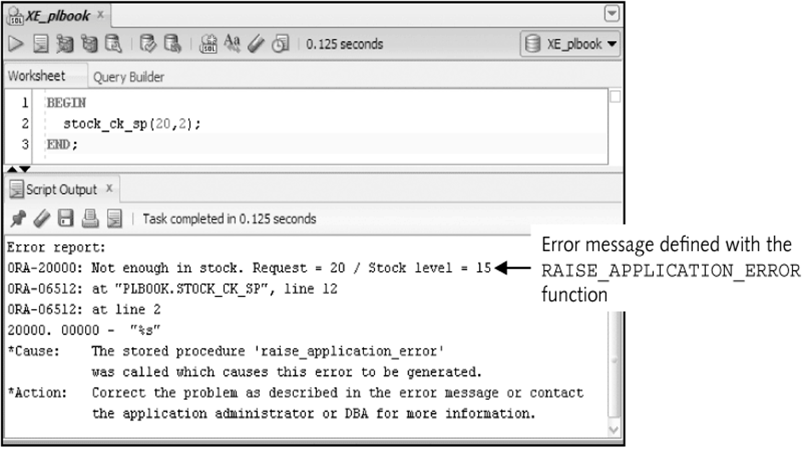



📋 This is my note-taking from what I learned in the class "Advanced Database Concepts"


<div class="notice--danger">{{ notice-2 | markdownify }}</div>

<!-- 📋 This is my note-taking from what I learned in the LinkedIn Learning course "Explore a Career in SQL Development"
{: .notice--danger} -->

<br>

# Objective

- Named program units
- Creating a procedure
- Calling a procedure from another procedure
- Using the DESCRIBE command with procedures
- Debugging procedures using DBMS_OUTPUT
- Using subprograms
- The scope of variables, exception handling and transaction control
- Using RAISE_APPLICATION_ERROR for error handling
- Removing procedures

<br>

# Brewbean’s Challenge

Develop programming modules for specific tasks such as calculating taxes or updating inventory



<br>

# Named Program Units

- PL/SQL blocks executed thus far have been anonymous blocks
- Now assign a name to the block and save it in the database as a stored program unit
- This makes program units reusable

<br>

# Types of Program Units

| Program Unit Type     | Description                                                                                                                                                                                                        |
| :-------------------- | :----------------------------------------------------------------------------------------------------------------------------------------------------------------------------------------------------------------- |
| Stored procedure      | Performs a task, such as calculating shipping costs, and can receive and input values as well as return values to the calling program. It's called explicitly from a program and is stored in the Oracle database. |
| Application procedure | Same as a stored procedure except it's saved in an Oracle application or library on the client side.                                                                                                               |
| Package               | Groups related procedures and functions. It's called from a program by name and is stored on the server side.                                                                                                      |
| Database trigger      | Performs a task automatically when a DML action occurs on the table it's associated with and is stored in the Oracle database.                                                                                     |
| Application trigger   | Performs a task automatically when a particular even occurs, such as the user clicking a button; it's stored in an Oracle application.                                                                             |

<br>

# Parameters - Make Program Units Reusable

Mechanisms used to send values in and out of program units

| Mode   | Description                                                                                                                                                                                                            |
| :----- | :--------------------------------------------------------------------------------------------------------------------------------------------------------------------------------------------------------------------- |
| IN     | Passes a value from the application environment to the procedure. This value is considered a constant because it can't be changed in the procedure. This mode is the default if no mode is indicated.                  |
| OUT    | Passes a value from the procedure to the application environment. If values are calculated or retrieved from the database in the procedure, OUT parameters are used to return these values to the calling environment. |
| IN OUT | Allows passing a value in and out with the same parameter. The value sent out can be different from the value sent in.                                                                                                 |

<br>

# Create Procedure Statement Syntax

```
-- Header
CREATE [OR REPLACE] PROCEDURE
   procedure_name
      [(parameter1_name[mode] data type,
        parameter2_name[mode] data type,
        ...)]

   -- PL/SQL block
   IS|AS
      declaration section
   BEGIN
      executable section

   EXCEPTION
      exception handlers
   END;
```

<br>

# Create Procedure Execution

Procedure to determine shipping cost


<br>

# Execute/Test the Procedure


<br>

# Compilation errors


<br>

# Named Association Method

Provide parameter values by position (default) or name


<br>

# IN OUT mode

Send value in and out via the same parameter

```
CREATE OR REPLACE PROCEDURE phone_fmt_sp
   (p_phone IN OUT VARCHAR2)
   IS

BEGIN
   p_phone := '(' || SUBSTR(p_phone,1,3) || ')' ||
                     SUBSTR(p_phone,4,3) || '-' ||
                     SUBSTR(p_phone,7,4);
END;
```

<br>

# Calling a Procedure from Another Procedure


<br>

# DESCRIBE Command

Lists the parameters of a program unit


<br>

# Debugging with DBMS_OUTPUT


<br>

# Sub-Programs

- A program unit defined within another program unit
- Must be declared in the DECLARE section of the containing program unit
- Can only be referenced by the containing program unit

<br>

# Variable Scope

- When nesting blocks, are variables shared?
- Inner blocks can use variables from outer blocks

.png>)

<br>

# Exception-Handling Flow


<br>

# Transaction Control Scope

- The scope refers to the group of DML statements that are affected by a particular transaction control statement
- By default, a session has a single DML queue and a transaction control statement would affect all DML in the queue regardless of which program unit initiated the statement
- DML statements of a program unit can be treated separately or as an autonomous transaction

<br>

# Autonomous Transaction

```
CREATE OR REPLACE PROCEDURE tc_test_sp2
   IS
   PRAGMA AUTONOMOUS_TRANSACTION;

BEGIN
   INSERT INTO bb_test1
   VALUES (2);
   COMMIT;
END;

-- Complied
```

<br>

# RAISE_APPLICATION_ERROR





<br>

# Remove a Procedure

```
DROP PROCEDURE procedure_name;
```

<br>

# Summary

- Named program unit assigns a name to a program unit so it can be reused
- Parameters are used to pass values in and out of program units
- Stored program units are saved in the database
- Parameter modes include: IN, OUT, and IN OUT
- Use DBMS_OUTPUT.PUT_LINE statement to debug
- A sub-program is a procedure declared within another procedure
- Variable scope must be considered with nested blocks
- Autonomous transactions must be explicitly created
- The RAISE_APPLICATION_ERROR function enables programmer defined errors
- Remove a procedure with the DROP PROCEDURE command

<br>

---

<br>

[Back to Top](#){: .btn .btn--primary }{: .align-right}
