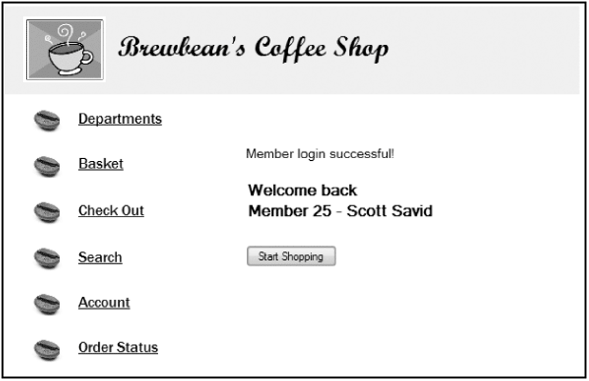
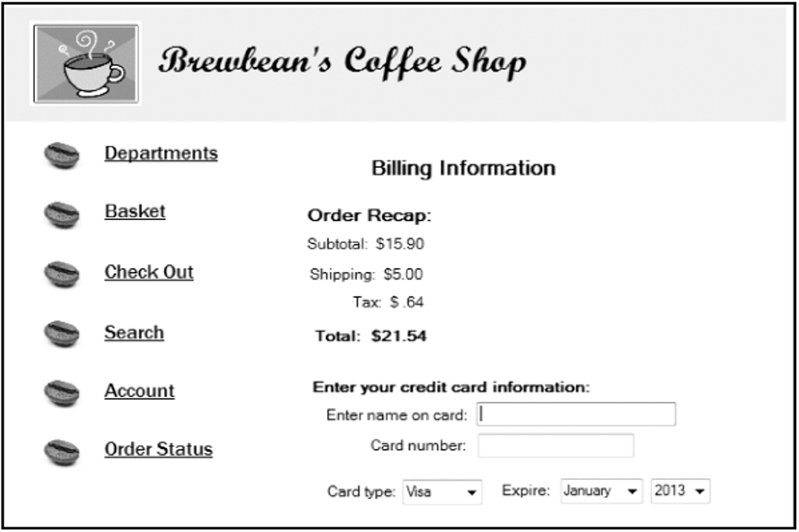



📋 This is my note-taking from what I learned in the class "Advanced Database Concepts"


<div class="notice--danger">{{ notice-2 | markdownify }}</div>

<!-- 📋 This is my note-taking from what I learned in the LinkedIn Learning course "Explore a Career in SQL Development"
{: .notice--danger} -->

<br>

# Objective

- Functions
- Creating a stored function
- Using OUT parameters in functions
- Including multiple RETURN statements in a function
- Using a RETURN statement in a procedure
- Using constraints of actual and formal parameters
- Understanding and controlling how parameter values are passed
- Working with function purity levels
- Additional program unit options
- Referencing the data dictionary for program units
- Deleting program units

<br>

# Brewbean’s Challenge

Need program module to check a user login



Need program module to calculate shipping cost based on the number of items in the basket



<br>

# Introduction to Functions

- A function is similar to a procedure in that it can accomplish a task and retrieve/return values
- A function is part of an expression, not an entire statement such as a procedure
- Can be used in both `PL/SQL` and `SQL statements`
- Same as Oracle-supplied functions (ROUND, TO_CHAR)
- Contains a RETURN statement

<br>

# Example of Oracle-Supplied Function

SQL

```
SELECT idProduct, price, ROUND(price, 0)
  FROM bb_product
  WHERE idProduct < 4;
```

PL/SQL

```
DECLARE
  v_amt1 NUMBER(5,2);
  v_amt2 NUMBER(3,0);
BEGIN
  v_amt1 := 32.50;
  v_amt2 := ROUND(v_amt1,0);
  DBMS_OUTPUT.PUT_LINE(v_amt2);
END;
```

<br>

# Function Create Statement


<br>

# Function Example


<br>

# Invoking a Function from a Block

An assignment statement is used – a function RETURNS a value!


<br>

# Attempt to Invoke Stand-alone


<br>

# Use Function in SQL


<br>

# Brewbean’s Member Display

```
CREATE OR REPLACE FUNCTION memfmt1_sf
  (p_id IN NUMBER,
   p_first IN VARCHAR2,
   p_last IN VARCHAR2)
  RETURN VARCHAR2
  IS
   lv_mem_txt VARCHAR2(35);
BEGIN
  lv_mem_txt := 'Member ' || p_id || ' - ' || p_first || ' ' || p_last;
  RETURN lv_mem_txt;
END;
```

<br>

# Member Display Test


<br>

# Using OUT Mode in a Function

OUT parameters are not typically used in functions, as:

- Mixing OUT and RETURN values can lead to confusion
- It prohibits the function from being used in SQL

<br>

# Multiple RETURN Statements

Note: Only one RETURN statement can execute


<br>

# RETURN Statement in a Procedure

- Different purpose than a RETURN statement in a function
- Used to change flow of execution
- Stop processing in that block and move to the next statement after procedure call
- Stand-alone statement with no arguments

<br>

# Parameter Constraints

- Formal parameters - Included in a program unit
- Actual parameters - Arguments used in a program unit call
- Argument for an OUT parameter must be a variable to hold the value returned
- Actual parameters determine the size of the formal parameters

<br>

# Passing Parameter Values

- Two techniques used to pass values between actual and formal parameters:
  : - Passed by Reference - Create pointer to value in the actual parameter
  : - Passed by Value - Copies value from actual to formal parameter
- Pass by value is the default
- Use a compiler hint to use pass by reference

<br>

# Pass by Reference


<br>

# Purity Levels

Restrictions on functions used in SQL

- Functions cannot modify any tables in Oracle8 and prior versions
  : Beginning with Oracle8i, the function cannot modify a table used in the SQL statement that calls the function; however, it may alter other tables if called from a non-select statement
- If used in a remote or parallel operation, no reading or writing of packaged variables allowed
- If used in a SELECT, VALUES, or SET clause, the function can write values to packaged variables; otherwise, it is not allowed
- Functions cannot be used in a check constraint or as a default value of a table column
- If the function calls other subprograms, the subprograms cannot break these rules
- Must be a stored database object (or in a stored package)
- Can use only IN parameters
- Must be a row function (not a group function)
- Formal parameter data types must use database data types (no PL/SQL data types such as BOOLEAN are permitted)
- Return data types must be a database data type
- Must not issue transaction control statements to end the current transaction prior to execution
- Cannot issue ALTER SESSION or ALTER SYSTEM commands

| Level Acronym | Level Name               | Level Description                                                                                                      |
| :------------ | :----------------------- | :--------------------------------------------------------------------------------------------------------------------- |
| WNDS          | Writes No Database State | Function does not modify any database tables (No DML)                                                                  |
| RNDS          | Reads No Database State  | Function does not read any tables (No select)                                                                          |
| WNPS          | Writes No Package State  | Function does not modify any packaged variables (packaged variables are variables declared in a package specification) |
| RNPS          | Reads No Package State   | Function does not read any packaged variables                                                                          |

<br>

# Purity Levels Test

Function that updates table bb_test1:

```
CREATE OR REPLACE FUNCTION fct_test1_sf
  (p_num IN NUMBER)
  RETURN NUMBER
IS
BEGIN
  UPDATE bb_test1
  SET col1 = p_num;
  RETURN p_num;
END;
```


<br>

# Additional Options

| Option          | Description                                                                                                                                                                                                                                                       |
| :-------------- | :---------------------------------------------------------------------------------------------------------------------------------------------------------------------------------------------------------------------------------------------------------------- |
| DETERMINISTIC   | Allows the Oracle system to use a saved copy of a function's return value, if it's available.                                                                                                                                                                     |
| PARALLEL_ENABLE | Allows using parallel operations when the function is used in a query.                                                                                                                                                                                            |
| PIPELINED       | Instructs the database to return the results of a table function iteratively. A table function creates a result set that's treated like a table in queries. It's typically used for complex, data-heavy operations associated with data-warehousing applications. |
| RESULT_CACHE    | New to Oracle 11g; instructs Oracle to cache function input values and result sets for potential reuse.                                                                                                                                                           |

<br>

# Data Dictionary Information

DESCRIBE identifies parameters and return value data type:


View source code using USER_SOURCE:


<br>

# Delete Functions

```
DROP FUNCTION function_name;
```

<br>

# Summary

- Functions can be used in PL/SQL and SQL statements
- A function is part of an expression
- Functions include parameters and must return a value
- OUT parameter rarely used
- Pass parameter values by value or reference
- Multiple RETURN statements can be included and only one is executed
- Actual versus formal parameters
  : - Formal parameters – included in a program unit
  : - Actual parameters – arguments used in a program unit call
- Purity levels refer to rules for functions to be used in SQL statements
- Options are available for improving performance such as PARALLEL_ENABLE
- DESCRIBE and USER_SOURCE view
- DROP command removed a function

<br>

---

<br>

[Back to Top](#){: .btn .btn--primary }{: .align-right}
