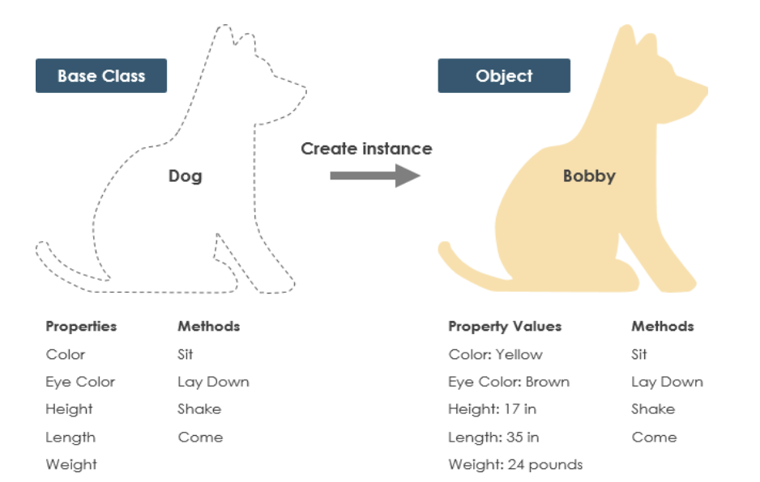
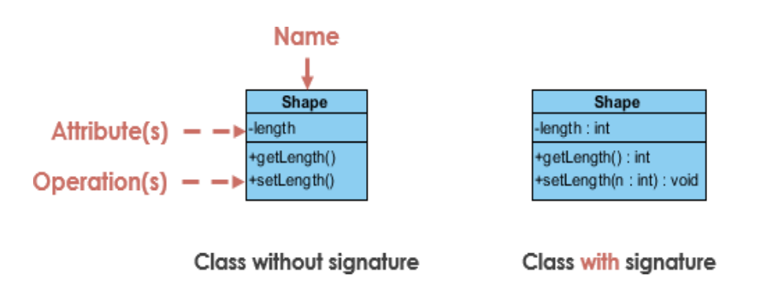
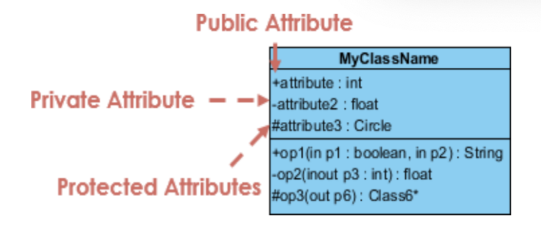
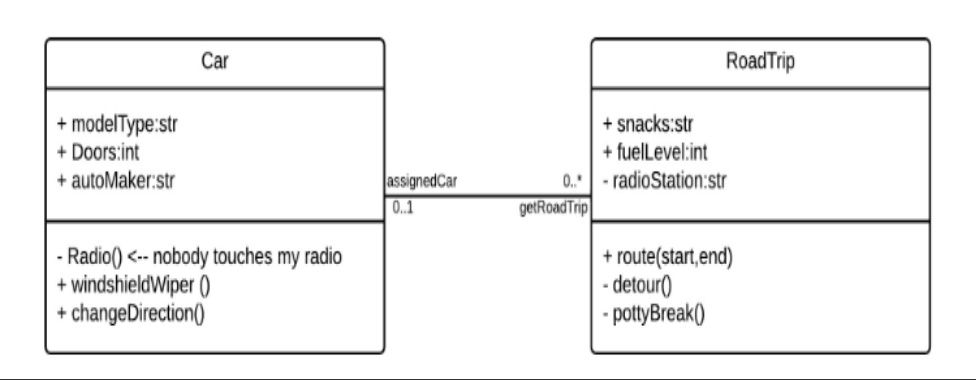
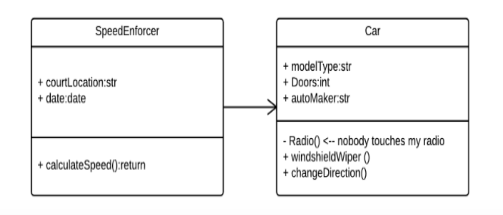
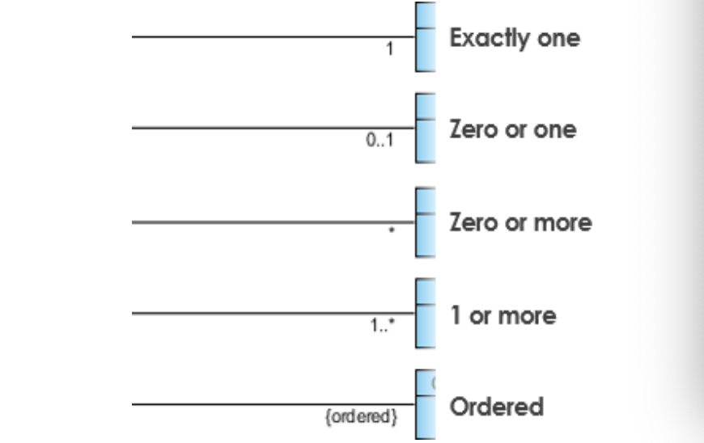
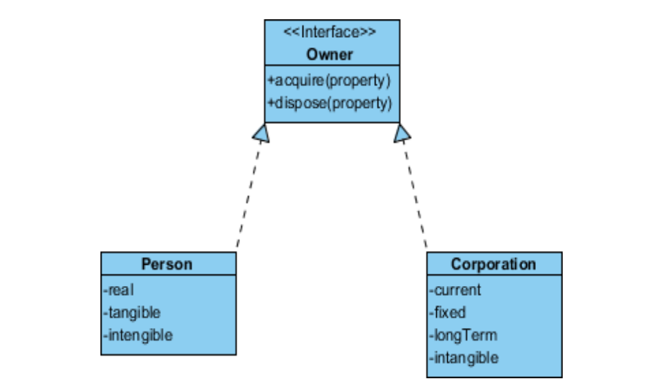
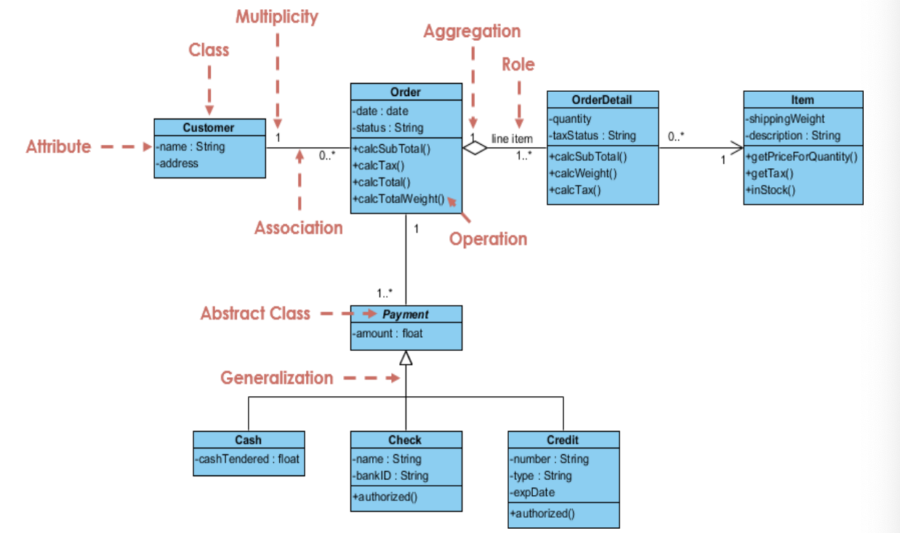

<!-- 

📋 This is my note-taking from what I learned in the c# tutorials!

- Reference tutorials link: <https://www.w3schools.com/cs/index.php>
  

{{ notice-2 | markdownify }}
 -->

📋 This is my note-taking from what I learned in the class "Programming 2"
{: .notice--danger}

 

# UML Class Diagram

The UML Class diagram is a graphical notation used to construct and visualize object oriented systems. A class diagram in the Unified Modeling Language (UML) is a type of static structure diagram that describes the structure of a system by showing the system's:

- classes
- their attributes
- operations (or methods)
- and the relationships among objects

 

# Class

- A Class is a blueprint for an object. Objects and classes go hand in hand. We can't talk about one without talking about the other. And the entire point of Object-Oriented Design is not about objects, it's about classes, because we use classes to create objects. So a class describes what an object will be, but it isn't the object itself.
- In fact, classes describe the type of objects, while objects are usable instances of classes. Each Object was built from the same set of blueprints and therefore contains the same components (properties and methods). The standard meaning is that an object is an instance of a class and object - Objects have states and behaviors.
- Class Name: The name of the class appears in the first partition.

A dog has states:

- Color
- Name
- Breed
- Behaviors
  : - Wagging
  : - Barking
  : - Eating

An object is an instance of a class.

 

## UML Class Notation

A class represent a concept which encapsulates state (attributes) and behavior (operations). Each attribute has a type. Each operation has a signature. The class name is the only mandatory information.

 

## Class Visibility

The +, - and # symbols before an attribute and operation name in a class denote the visibility of the attribute and operation.

| +                                       | -                                        | #                                         |
| :-------------------------------------- | :--------------------------------------- | :---------------------------------------- |
| denotes public attributes or operations | denotes private attributes or operations | denotes protected attributes or operation |

 

# Class Attributes

- Attributes are shown in the second partition.
- The attribute type is shown after the colon.
- Attributes map onto member variables (data members) in code.

 

# Class Operations(Methods)

- Operations are shown in the third partition. They are services the class provides.
- The return type of a method is shown after the colon at the end of the method signature.
- The return type of method parameters are shown after the colon following the parameter name. Operations map onto class methods in code.

 

# Relationships between Classes

A class may be involved in one or more relationships with other classes. A relationship can be one of the following types:

 

## Association

Associations are relationships between classes in a UML Class Diagram. They are represented by a solid line between classes. Associations are typically named using a verb or verb phrase which reflects the real world problem domain.

### Simple Association

- A structural link between two peer classes.
- There is an association between Class1 and Class2.

### Bidirectional association

The default relationship between two classes. Both classes are aware of each other and their relationship with the other. This association is represented by a <u>straight line</u> between two classes.

### Unidirectional association

A slightly less common relationship between two classes. One class is aware of the other and interacts with it. Unidirectional association is modeled with a straight connecting line that points an <u>open arrowhead</u> from the knowing class to the known class.

### Cardinality

Cardinality is expressed in terms of:

- one to one
- one to many
- many to many

 

## Inheritance (or Generalization)

A generalization is a taxonomic relationship between a more general classifier and a more specific classifier. Each instance of the specific classifier is also an indirect instance of the general classifier. Thus, the specific classifier inherits the features of the more general classifier.

- Represents an "is-a" relationship.
- An abstract class name is shown in italics.
- SubClass1 and SubClass2 are specializations of SuperClass.

The figure below shows an example of inheritance hierarchy. SubClass1 and SubClass2 are derived from SuperClass. The relationship is displayed as a <u>solid line with a hollow arrowhead</u> that points from the child element to the parent element.

 

## Realization

Realization is a relationship between the blueprint class and the object containing its respective implementation level details. This object is said to realize the blueprint class. In other words, you can understand this as the relationship between the interface and the implementing class.

For example, the Owner interface might specify methods for acquiring property and disposing of property. The Person and Corporation classes need to implement these methods, possibly in very different ways.

 

## Dependency

An object of one class might use an object of another class in the code of a method. If the object is not stored in any field, then this is modeled as a dependency relationship.

- A special type of association.
- Exists between two classes if changes to the definition of one may cause changes to the other (but not the other way around).
- Class1 depends on Class2

The relationship is displayed as a <u>dashed line with an open arrow</u>.

The figure below shows example of dependency. The Person class might have a hasRead method with a Book parameter that returns true if the person has read the book (perhaps by checking some database).

 

## Aggregation

- A special type of association.
- It represents a "part of" relationship.
- Class2 is part of Class1.
- Objects of Class1 and Class2 have separate lifetimes.

The relationship is displayed as a <u>solid line with a unfilled diamond</u> at the association end, which is connected to the class that represents the aggregate.

- Ex: System – Hard disk, Monitor, Keyboard.

 

## Composition

- A special type of aggregation where parts are destroyed when the whole is destroyed.
- Objects of Class2 live and die with Class1.
- Class2 cannot stand by itself.

The relationship is displayed as a <u>solid line with a filled diamond</u> at the association end, which is connected to the class that represents the whole or composite.

- Ex: Order - Items.

 

# UML Class Diagram

[UML_Diagram_Explanation_Video](https://ca.video.search.yahoo.com/search/video?fr=mcafee&ei=UTF-8&p=UML+Diagrams+explaination&type=E211CA714G91738&guccounter=1&guce_referrer=aHR0cHM6Ly9maWxlLm5vdGlvbi5zby8&guce_referrer_sig=AQAAAMB2t30evKcE3MSC_j2ZyCRxZA4QNpzwPKuoZlnr2Fu5knEk29rjM1AaxjDGHQunKd-g276_K6FEoYsJPRkRCWK2HxZaUDRv-PCr5aptTcBSnPOaFpb-bKTfq4Gw9Dc4rxm17OR7MphuuLW4j3KXZ1O3dkHuouqEqxW_xZkoonZ2)

 

---

 

[Back to Top](#){: .btn .btn--primary }{: .align-right}
