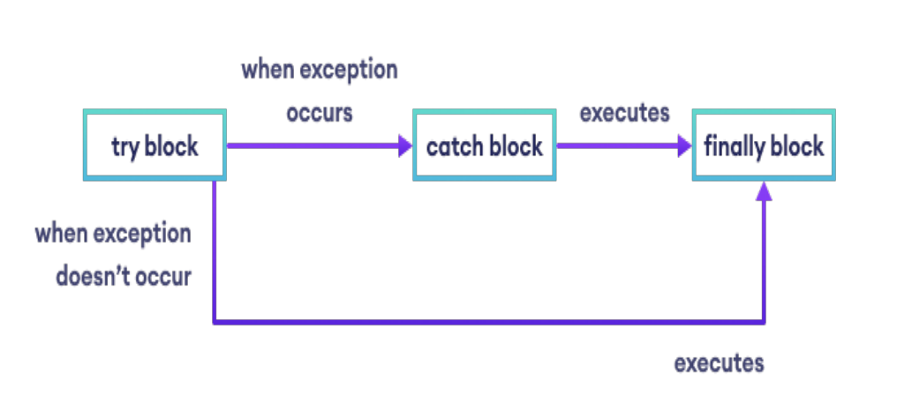
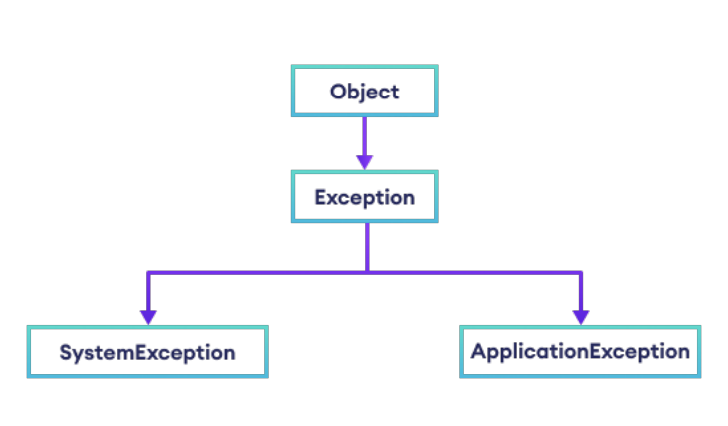
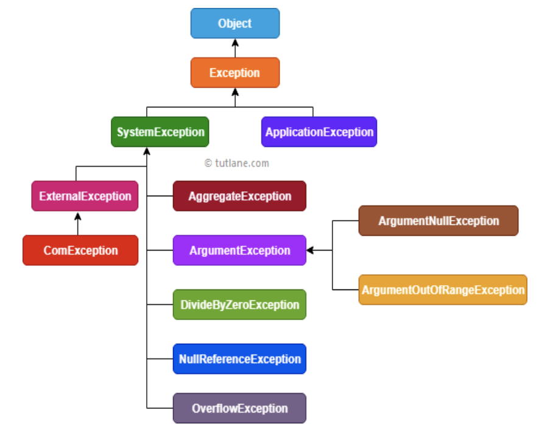



📋 This is my note-taking from what I learned in the c# course and tutorial!

- Course "Programming 2"
- GeeksforGeeks Tutorial
  

<div class="notice--danger">{{ notice-2 | markdownify }}</div>

<br>

# Exception Handling

An exception is defined as an event that occurs during the execution of a program that is unexpected by the program code.

The actions to be performed in case of occurrence of an exception is not known to the program.

In such a case, we create an exception object and call the exception handler code.

The execution of an exception handler so that the program code does not crash is called `exception handling`.

`Exception Handling` is important because it gracefully handles an unwanted event, an exception so that the program code still makes sense to the user.

| Keyword | Definition                                                                              |
| :------ | :-------------------------------------------------------------------------------------- |
| try     | Used to define a try block. This block holds the code that may throw an exception.      |
| catch   | Used to define a catch block. This block catches the exception thrown by the try block. |
| finally | Used to define the finally block. This block holds the default code.                    |
| throw   | Used to throw an exception manually.                                                    |

<br>

## What Happens if an Exception is Raised in the Program in C#?

When an Exception is raised in C#, the program execution is terminated abnormally. That means the statements placed after the exception-causing statements are not executed but the statements placed before the exception-causing statement are executed by CLR.

Each exception class provides a specific exception error message. All exception classes are responsible for abnormal termination of the program as well as they will be displaying an error message which specifies the reason for abnormal termination. &rarr; They provide an error message specific to that error.

So, whenever a run-time error occurs in a program,

- First the Exception Manager under the CLR(Common Language Runtime) identifies the type of error that occurs in the program,
- then creates an object of the Exception class related to that error and throws that object which will immediately terminate the program abnormally on the line where error got occur and display the error message related to that class.
- Note: Exception class is the superclass of all Exception classes in C#.

### Example: Divide By Zero Logical Error

```
class Program
{
    static void Main(string[] args)
    {
        int a = 20;
        int b = 0;
        int c;

        Console.WriteLine("A value = " + a);
        Console.WriteLine("B value = " + b);

        c = a/b;

        Console.WriteLine("C value = " + c);
    }
}
```

The CLR terminates the program execution by throwing DivideByZeroException because the logical mistake we committed here is dividing an integer number by integer zero.

So, what CLR will do in this case,

- First it will check what type of logical error is this
- It will find that it will be a Divide By Zero Logical Error.
- So, then what CLR will do it, it will create an instance of DivideByZeroException class,
- and then it will throw that instance by using the throw statement will throw new DivideByZeroException();

Defining the exception technically as follows:

- An exception is an event because when an exception is raised, CLR internally executes some logic to prepare that exception-related messages.
- The Exception is a signal because by looking into the exception message, developer will take necessary actions against that exception.



Is the above Exception Message user understandable?

Definitely, the answer is NO. The user cannot understand the above exception message because they are `.NET-Based exception messages`. So, the user cannot take any decision alone to resolve the above problem. A developer should guide to solve the above problem.

What is the solution to the above problem?

It is the developer's responsibility to convert `.NET exception messages` in to user-understandable message formats. To solve this problem, developer should handle the exception. Using the exception handling mechanism, the developer can catch the exception and can print and display user-understandable messages.


<div class="notice--danger">{{ notice-2 | markdownify }}</div>

### Example: Runtime Error

```
using System;

class GFG
{
    static void Main(string[] args)
    {
        // Declare an array of max index 4
        int[] arr = {1,2,3,4,5};

        // Display values of array elements
        for (int i = 0; i < arr.Length; i++)
        {
            Console.WriteLine(arr[i]);
        }

        // Try to access invalid index of array
        Console.WriteLine(arr[7]);

        // An exception is thrown upon executing the above line
    }
}
```

Runtime Error:

```
Unhandled Exception:
System.IndexOutOfRangeException: Index was outside the bounds of the array.
at GFG.Main (System.String[] args) [0x0002e] in <9fa39b3b4dec49eb8af89dc70d5a0618>:0
[ERROR] FATAL UNHANDLED EXCEPTION: System.IndexOutOfRangeException: Index was outside the bounds of the array.
at GFG.Main (System.String[] args) [0x0002e] in <9fa39b3b4dec49eb8af89dc70d5a0618>:0
```

Output:

```
1
2
3
4
5
```

- In the above, the array named 'arr' is defined for 5 elements, indices 0 to 4.
- When we try to access the 7th element of the array, that is non-exist, program code throws an exception and the above message is displayed.
- The exception can be handled using the System.Exception class of C#. This will be depicted in the code given below.

<br>

## What is Exception Handling in C#?

Exception Handling in C#:

- The process of catching the exception for converting the CLR given exception message to an end-user understandable message
- The process of catching the exception for stopping the abnormal termination of the program whenever run-time errors are occurring

Advantages that we will be getting, once we handle an exception under a program:

- We can stop the Abnormal Termination
- We can perform any corrective action that may resolve the problem
- Displaying a user-friendly error message, so that the user can resolve the problem provided if it is under user's control

<br>

## What is the Procedure to Handle Exceptions in C#?

1. Preparing the exception object that is appropriate to the current logical mistake
2. Throwing that exception to the appropriate exception handler
3. Catching that exception
4. Taking necessary actions against that exception

<br>

# How can we Handle an Exception in .NET?

1. Logical Implementation
2. Try Catch Implementation

<br>

## 1. Logical Implementation to Handle Exception

In logical implementation, we need to handle the exception by using `logical statements`. If it's not possible to handle an exception using logical implementation, then we need to go for try-catch implementation.

```
using System;

namespace ExceptionHandlingDemo
{
    class Program
    {
        static void Main(string[] args)
        {
            int num1, num2, result;

            Console.WriteLine("Enter the first num: ");
            num1 = int.Parse(Console.ReadLine());
            Console.WriteLine("Enter the second num: ");
            num2 = int.Parse(Console.ReadLine());

            if(num2 == 0)
            {
                Console.WriteLine("Second num should not be zero");
            }
            else
            {
                result = num1/num2;
                Console.WriteLine($"Result = {result}");
            }
            Console.ReadKey();
        }
    }
}
```

- Check the second number
- If it equals 0, then print one message saying the second number should not be zero
- Else if the second number is not zero, then perform division operation
- Show the results on the console
- Note: We are using If-Else logical statement to handle the exception



If we enter any character like 'abc,' it will give us one exception which is `FormatException`

So, To handle such types of exceptions in C#, we need to go for try-catch implementation.

The point that we need to remember is "If we are unable to handle the exception using logical implementation, then only we need to go for try-catch implementation"


<div class="notice--danger">{{ notice-2 | markdownify }}</div>

<br>

## 2. Try Catch Implementation to Handle Exception

To implement the try-catch implementation, the .NET framework provides three keywords:

> Try Block:
>
> The try block establishes a block in which we need to write the exception causing and its related statements. &rarr; That means `exception-causing statements and the related statements which we should not execute, when an exception occurred` must be placed in the try block.

> Catch Block:
>
> The catch block is used to catch the exception that is thrown from its corresponding try block. It has the logic to take necessary actions on that caught exception.
>
> It takes only a single parameter of type Exception or any child class of the parent Exception class. Inside the catch block, we can write any statement which is legal in .NET including raising an exception.
>
> In this case, we can stop the abnormal termination of the program and we can also give user understandable error messages so that the user can take necessary action to resolve the error.

> Finally Block:
>
> The finally block establishes a block that definitely executes the statements placed in it irrespective of whether any exception has occurred or not.
>
> That means the statements that are placed in finally block are always going to be executed irrespective of whether any exception is thrown or not, irrespective of whether the thrown exception is handled by the catch block or not.

The code that may generate an exception is placed inside the try block. In this case, the access to the 7th element is put inside the try block. When that statement is executed an exception is generated, which is caught by the catch block. The object of the type `IndexOutOfRangeException` is used to display a message to the user about the exception that has occurred.

> Syntax: try...catch block
>
> ```
> try
> {
>   // statements that may cause an exception
> }
> catch(Exception obj)
> {
>   // handler code
> }
> ```

```
using System;

class Program : System.Exception
{
    static void Main(string[] args)
    {
        // Declare an array of max index 4
        int[] arr = {1,2,3,4,5};

        // Display values of array elements
        for (int i = 0; i < arr.Length; i++)
        {
            Console.WriteLine(arr[i]);
        }

        try
        {
            // Try to access invalid index of array
            Console.WriteLine(arr[7]);

            // An exception is thrown upon executing the above line
        }

        catch (IndexOutOfRangeException e)
        {
            /* The message property of the object of type IndexOutOfRangeException is used to display the type of exception that has occurred to the user. */
            Console.WriteLine($"An Exception has occurred : {e.Message}");
        }
    }
}
```

Output:

```
1
2
3
4
5
An Exception has occurred : Index was outside the bounds of the array.
```

> Syntax: try...catch...finally block
>
> ```
> try
> {
>   // statements that may cause an exception
> }
> catch(Exception obj)
> {
>   // handler code
> }
> finally
> {
>     // default code
> }
> ```



```
using System;

public class Program
{
    static void Main()
    {
        Console.Write("Enter the first num: ");
        int fNum = int.Parse(Console.ReadLine());
        Console.Write("Enter the second num: ");
        int sNum = int.Parse(Console.ReadLine());

        try
        {
            // Code that may raise an exception
            int divisionResult = fNum/sNum;
            Console.WriteLine("Division of two numbers is: " + divisionResult);
        }

        // Executed only when an exception is raised
        catch (Exception e)
        {
            Console.WriteLine("An exception occurred: " + e.Message);
        }

        finally
        {
            // Executed whether of exception occurred or not
            Console.WriteLine("Sum of two numbers is : " + (fNum + sNum));
        }
    }
}
```

Output:

```
Enter the first num: 8
Enter the second num: 0
An exception occurred: Attempted to divide by zero
Sum of two numbers is: 8
```

<br>

## Using Multiple try-catch blocks

Multiple catch blocks are used when we are not sure about the exception type that may be generated, so we write different blocks to tackle any type of exception that is encountered.

The finally block is the part of the code that has to be executed irrespective of if the exception was generated or not. In the program given below the elements of the array are displayed in the finally block.

> Syntax
>
> ```
> try
> {
>     // statements that may cause an exception
> }
> catch (Specific_Exception_type obj)
> {
>     // handler code
> }
> catch (Specific_Exception_type obj)
> {
>     // handler code
> }
> .
> .
> .
> finally
> {
>     // default code
> }
> ```

```
using System;

class Program
{
    static void Main(string[] args)
    {
        int[] arr = {19,0,75,52};

        try
        {
            // Try to generate an exception
            for (int i = 0; i < arr.Length; i++)
            {
                Console.WriteLine(arr[i] / arr[i + 1]);
            }
        }

        // Catch block for invalid array access
        catch (IndexOutOfRangeException e)
        {
            Console.WriteLine($"An Exception has occurred : {e.Message}");
        }

        // Catch block for attempt to divide by zero
        catch (DivideByZeroException e)
        {
            Console.WriteLine($"An Exception has occurred : {e.Message}");
        }

        // Catch block for value being out of range
        catch (ArgumentOutOfRangeException e)
        {
            Console.WriteLine($"An Exception has occurred : {e.Message}");
        }

        // Finally block will execute irrespective of the above catch blocks
        finally
        {
            for (int i = 0; i < arr.Length; i++)
            {
                Console.Write($" {arr[i]}");
            }
        }
    }
}
```

Output:

```
An Exception has occurred : Attempted to divide by zero.
 19 0 75 52
```

<br>

# Exception and It's Types

The Exception Hierarchy in C#:




The major two exception classes derived from the Exception class are:

- SystemException, also called `Built-In Exceptions`
- ApplicationException, also called `User-Defined Exceptions`

<br>

## System Exception (Built-In Exceptions)

1. StackOverflowException
   : This exception is thrown, when the execution stack exceeds the stack size. Normally occurs when we use an infinite loop in the program.
2. ArithmeticException
   : This exception is thrown for errors in arithmetic, casting, or conversion. It is a base class for exception classes like:
   : - DivideByZeroException: This exception is thrown, when an integer is divided by 0. For example, when we try to perform 5 divided by 0.
   : - NotFiniteNumberException: This exception is thrown, when a floating-point value is positive or negative infinity or NaN(Not-a-Number).
   : - OverFlowException: This exception is thrown, when the result produced by the operation is out of range.
3. ValidationException
   : This exception is thrown, when an input value is not valid. For example, if we enter an integer value in a field that expects a DateTime value, this exception is thrown.
4. ArgumentException
   : This exception is thrown, when we provide one invalid argument in a method. For example, when we pass an argument of a data type that doesn't match specified parameters during a method's call, then this exception occurs.
5. IndexOutOfRangeException
6. FormatException
7. NullReferenceException
8. FileNotFoundException
9. SQLException, etc

<br>

## Application Exception (User-Defined Exceptions)

User-defined exceptions are useful when we want to code an exception that may not be defined by the language.

For example, in a boiler room, if the temperature rises above some threshold then the heat must be turned off.

We define a class DivByZero that inherits from Exception and is called by the DivisionOperation function when the denominator is equal to zero. Since the call for the function is may or may not throw an exception it is placed in the try block. A catch block is defined to catch any exception of type Exception and the Message property prints the type of exception that has occurred.

```
using System;

// User defined Exception class
// Child of Exception
class DivByZero : Exception
{
    // Constructor
    public DivByZero()
    {
        Console.WriteLine("Exception has occurred : ");
    }
}

class Program
{
    // Method to perform Division
    public double DivisionOperation(double numerator, double denominator)
    {
        // Throw exception when denominator value is 0
        if (denominator == 0)
            throw new DivByZero();

        // Otherwise return the result of the division
        return numerator / denominator;
    }

    // Main
    static void Main(string[] args)
    {
        Program obj = new Program();
        double num = 9, den = 0, quotient;

        try
        {
            // Code block that may cause an exception
            quotient = obj.DivisionOperation(num, den);
            Console.WriteLine($"Quotient = {quotient}");
        }

        // Catch block to catch the generic exception
        catch (Exception e)
        {
            // Message property of exception object e will give the specific type of exception
            Console.WriteLine(e.Message);
        }
    }
}
```

Output:

```
Exception has occurred : Exception of type 'DivByZero' was thrown.
```

<br>

---

<br>

[Back to Top](#){: .btn .btn--primary }{: .align-right}
