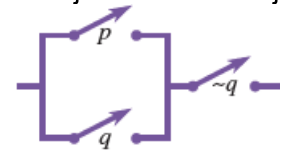
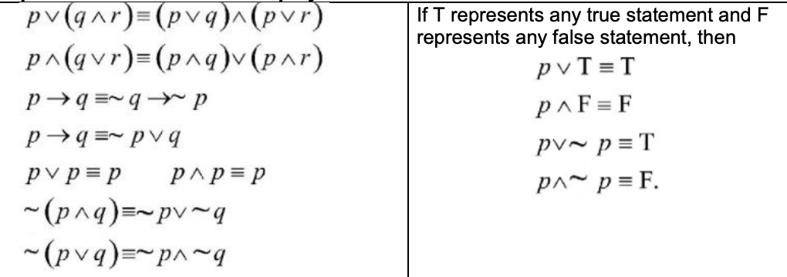
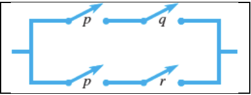
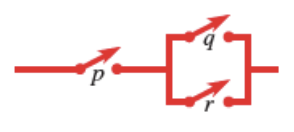
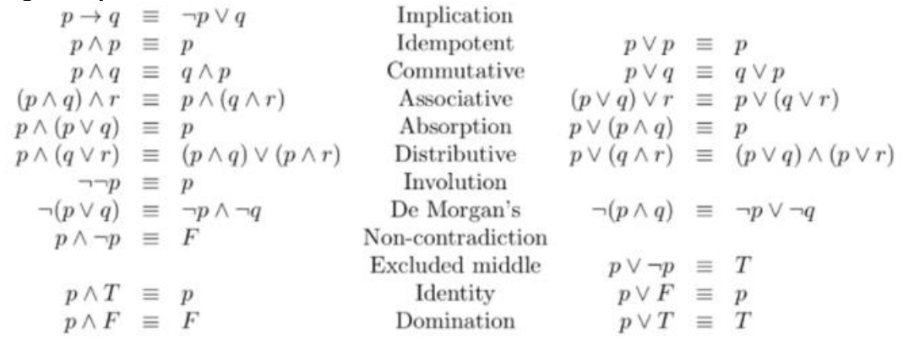
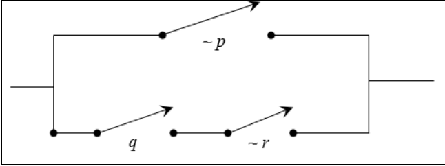

<!-- 

📋 This is the tech-news archives to help me keep track of what I am interested in!

- Reference tech news link: <https://thenextweb.com/news/blockchain-development-tech-career>
  

{{ notice-2 | markdownify }}
 -->

📋 This is my note-taking from what I learned in the class "Math185-002 Discrete Mathematics"
{: .notice--danger}

 

# Overview of Course

## Topics

- The Conditional and Circuits
- More on The Conditional

## Weekly Learning Outcomes

- Evaluate the truth value of conditional statements.
- Identify the converse, inverse, and contrapositive of a conditional statement.
- Evaluate the truth value of a bi-conditional statement.

 

# 3.3 The Conditional and Circuits

The Conditional and Circuits

## Conditionals

- A `conditional` statement is a compound statement that uses the connective if...then.
- The conditional is written with an arrow, so "if p then q" is symbolized `p -> q` we read this as "p implies q" or "if p then q." The statement p is the `antecedent`, while q is the `consequent`.

> Example 1:
>
> You will fail when you do not study. It has similar meaning as: If you do not study, (then) you will fail.

> Example 2:
>
> If you run the red, (then) you will get a ticket. (Note: that the conditional connective does not imply a cause-and-effect relationship.)
>
> - You run the red - You get a ticket
> - You run the red - You don’t get a ticket
> - You don’t run a red - You get a ticket
> - You don’t run a red - You don’t get a ticket

Note: The conditional connective (if...then) may sometimes be hidden.

 

## Truth Table for the Conditional "p &rarr; q"

| p   | q   | p &rarr; q |
| :-- | :-- | :--------: |
| T   | T   |     T      |
| T   | F   |     F      |
| F   | T   |     T      |
| F   | F   |     T      |

Note: The statement "if p then q" is true in all cases, except when p is true and q is false.

## Special Characteristics of Conditional Statements

1. p &rarr; q is false only when the antecedent is true and the consequent is false.
2. If the antecedent is false, then p &rarr; q is automatically true.
3. If the consequent is true, then p &rarr; q is automatically true.

> Example 1: Finding the Truth Value of a Conditional
>
> Given that p, q, and r are all false, find the truth value of the following statement.
>
> > (p &rarr; ~q) &rarr; (~r &rarr; q)
>
> Solution:
>
> Using the shortcut method, we can replace p, q, and r with F
>
> - (p &rarr; ~q) &rarr; (~r &rarr; q)
> - (F &rarr; ~F) &rarr; (~F &rarr; F)
> - (F &rarr; T) &rarr; (T &rarr; F)
> - T &rarr; F
> - F
>
> The statement (p &rarr; ~q) &rarr; (~r &rarr; q) is false when p, q, and r are all false.

> Example 2: Determining Whether Conditionals Are True or False
>
> Write true or false for each statement. Here T represents a true statement, and F represents a false statement.
>
> - a) T &rarr; 17 = 32
> - b) (8 < 2) &rarr; F
> - c) (4 ≠ 3 + 1) &rarr; T
>
> Solution:
>
> - a) Because the antecedent is true, while the consequent, 7 = 3, is false, the given statement is false by the first point mentioned above.
> - b) The antecedent is false, so the given statement is true by the second observation.
> - c) The consequent is true, making the statement true by the third characteristic of conditional statements.

> Example 3:
>
> Decide whether each statement is True or False (T represents a true statement, F represents a false statement).
>
> - a) (3 > 8) → T => Answer : False
> - b) (7 = 5) → F => Answer : True

> Example 4: Constructing Truth Table
>
> (~p &rarr; ~q) &rarr; (~p ⋀ q)
>
> Solution:
>
> 

 

## Tautology

A statement that is always true, no matter what the truth values of the components, is called a `tautology`. (We may check by forming truth tables)

> Example 1: Constructing Truth Table
>
> (p &rarr; q) &rarr; (~p ⋁ q)
>
> Solution:
>
> 

Several other examples of tautologies:

p ⋁ ~p, p &rarr; p, and (~p ⋁ ~q) &rarr; ~(p ⋀ q)

 

## Different Forms of Conditional

- Writing a Conditional as an "or" (disjunction) Statement
  : p &rarr; q is equivalent to ~p ⋁ q.
- Negation of a Conditional
  : The negation of Negation of p &rarr; q is equivalent to ~p ⋁ q.
  : Applying De Morgan’s law: ~(p &rarr; q) ≡ ~(~p ⋁ q) ≡ p ⋀ ~q

> Example 1:
>
> Determine the negation of each statement.
>
> 1. If you call her, she will ignore. &rarr; Answer: You call her, and she will not ignore.
> 2. All dogs love bones. &rarr; Answer: All dogs' love bones has similar meaning as "if it is a dog, it loves bones." It is a dog and it does not love bones.

 

## Circuits

Current will flow through switch when it is closed and not when it is open.

> Series Circuit
>
> Figure below shows two switches connected in series. In series connection, current will flow only when both switches are closed.
>
> 
>
> - Series circuit resembles the conjunction (and) p ⋀ q.
> - p ⋀ q is true only when both p and q are true.

> Parallel Circuit
>
> Figure below shows two switches connected in parallel. In parallel connection, current will flow only when either of the switch is closed or both switches are closed.
>
> 
>
> - Parallel circuit resembles the disjunction (or) p ⋁ q.
> - p ⋁ q is true only when either p or q are true, or both are true.
>
> 
>
> - The circuit in the above figure corresponds to the statement "(p ⋁ q) ⋀ ~q, which is a compound statement involving both a conjunction and a disjunction.

## Some Equivalent Statements to Simplify Circuits

> Example 1:
>
> Simplify the circuit shown below.
>
> 
>
> Solution:
>
> - p and q are connected in series with each other which is equivalent to p ⋀ q
> - p and r are connected in series with each other which is equivalent to p ⋀ r
> - These two series connected in parallel with each other which is equivalent to (p ⋀ q) ⋁ (p ⋀ r)
> - (p ⋀ q) ⋁ (p ⋀ r) ≡ p ⋀ (q ⋁ r)
>   : 

 

## Logical Equivalence

> Example 1:
>
> Draw a circuit for p &rarr; (q ⋀ ~r)
>
> Solution:
>
> Writing a Conditional as an "or" (disjunction) Statement (I added). The equivalent simplified expression is p &rarr; (q ⋀ ~r) ≡ ~p ⋁ (q ⋀ ~r)
>
> 

 

# 3.4 More on The Conditional

More on The Conditional

## Converse, Inverse, and Contrapositive

In a conditional statement p &rarr; q, p is called `antecedent`, and q is called `consequent`.

- If antecedent p and consequent q are interchanged, A new conditional statement q → p is formed which is called `converse` of the given conditional statement.
- If antecedent p and consequent q are both negated, A new conditional statement ~p → ~q is formed which is called `inverse` of the given conditional statement.
- If antecedent p and consequent q both are interchanged and negated, A new conditional statement ~q → ~p is formed which is called `contrapositive` of the given conditional statement.

## Summary

| Conditional Statement | p → q   | If p, then q         |
| :-------------------- | :------ | :------------------- |
| Converse              | q → p   | If q, then p         |
| Inverse               | ~p → ~q | If not p, then not q |
| Contrapositive        | ~q → ~p | If not q, then not p |

## Truth Table for Conditional, Converse, Inverse, and Contrapositive Statements

Note: A conditional statement and its contrapositive are equivalent, and the converse and inverse are equivalent.

> Example 1:
>
> Given the conditional statement, If I am a student, then I attend school,
>
> - Determine: a) The converse b) The inverse c) The contrapositive.
>
> Solution:
>
> - a) Converse: If I attend school, then I am a student.
> - b) Inverse: If I am not a student, then I do not attend school.
> - c) Contrapositive: If I do not attend school, then I am not a student.

 

## Equivalences

Alternative Forms of "If p, then q":

The conditional p → q can be translated in any of the following ways:

| 1   | If p, then q.          |
| :-- | :--------------------- |
| 2   | If p, q.               |
| 3   | p implies q.           |
| 4   | p only if q.           |
| 5   | p is sufficient for q. |
| 6   | q is necessary for p.  |
| 7   | All p are q.           |
| 8   | q if p.                |

> Example 1: Write each statement in the form "if p, then q."
>
> 1. You’ll be sorry if I go.
>    : If I go, then you’ll be sorry.
> 2. Today is Sunday only if yesterday was Saturday.
>    : If today is Sunday, then yesterday was Saturday.
> 3. All Chemists wear lab coats.
>    : If you are a Chemist, then you wear a lab coat.

 

## Biconditionals

- The compound statement p if and only if q (often abbreviated p iff q) is called a biconditional. It is symbolized p ↔ q and is interpreted as the conjunction of the two conditionals p → q and q → p.
- p ↔ q ≡ (p → q) ⋀ (q → p)

| p q | p → q | q → p | (p → q) ⋀ (q → p) |
| :-: | :---: | :---: | :---------------: |
| T T |   T   |   T   |         T         |
| T F |   F   |   T   |         F         |
| F T |   T   |   F   |         F         |
| F F |   T   |   T   |         T         |

> Example 1:
>
> Determine whether each biconditional statement is true or false.
>
> - a) 5 + 4 = 9 if and only if 4 + 2 = 6.
>   : True (both component statements are true)
> - b) 8 = 7 if and only if 8 = 3 + 5.
>   : False (one component is true, one false)
> - c) 9 + 6 = 12 if and only if 9 + 7 = 10.
>   : True (both component statements are false)

 

## Consistent or Contrary

Two statements about the same object are:

- Consistent–if they can both be true.
- Contrary–if they both cannot be true.

> Example 1:
>
> - Consistent–if they can both be true.
>   : That book is nonfiction. That book costs more than $70.
> - Contrary–if they both cannot be true.
>   : Elvis is alive. Elvis is dead.

 

---

 

[Back to Top](#){: .btn .btn--primary }{: .align-right}
