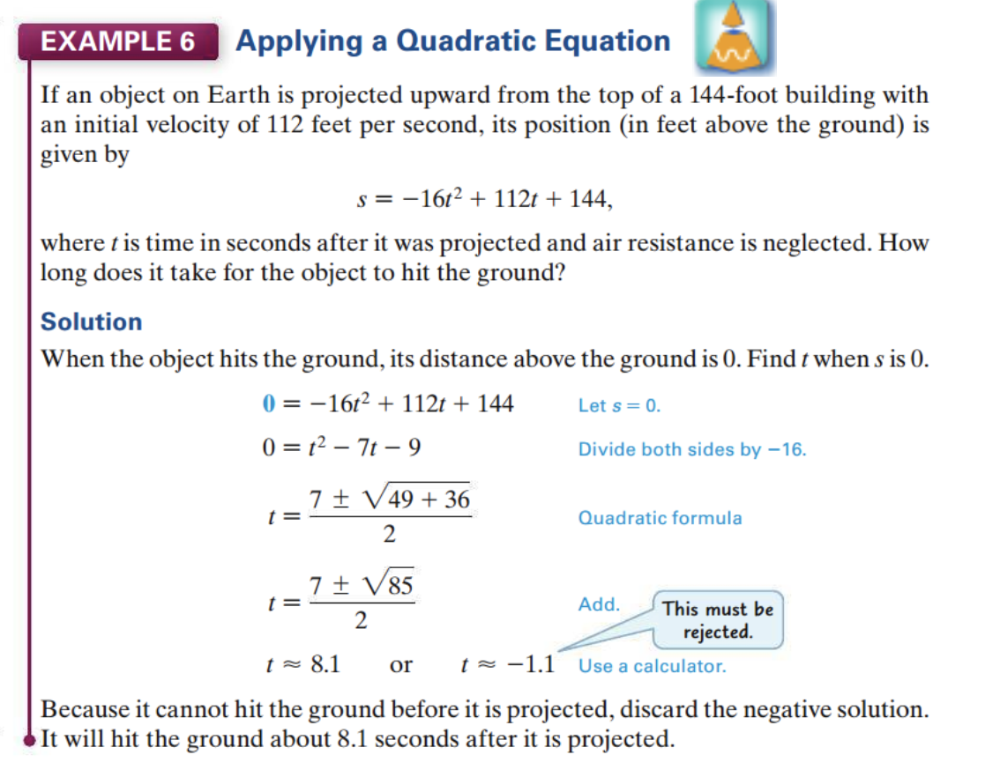

<!-- 

📋 This is the tech-news archives to help me keep track of what I am interested in!

- Reference tech news link: <https://thenextweb.com/news/blockchain-development-tech-career>
  

{{ notice-2 | markdownify }}
 -->

📋 This is my note-taking from what I learned in the class "Math175-002 Functions & Number Systems"
{: .notice--danger}

> ## Objectives
>
> 1. Recognize a quadratic equation in standard form.
> 2. Use the zero-factor property to solve a quadratic equation (when applicable).
> 3. Use the square root property to solve a quadratic equation (when applicable).
> 4. Use the quadratic formula to solve a quadratic equation.
> 5. Solve an application that leads to quadratic equations.

 

## Quadratic Equations and Applications

1. Quadratic Equations
2. Zero-Factor Property
3. Square Root Property
4. Quadratic Formula
5. Applications

 

## 1. Quadratic Equations

We have considered linear equations and inequalities in earlier sections. Now we investigate second-degree, or quadratic, equations.

An equation that can be written in the form

> Standard form: ax2 + bx + c = 0

where a, b, and c are real numbers, with a≠0, is a quadratic equation. The form of the equation given above is called standard form.

 

## 2. Zero-Factor Property

One method of solving a quadratic equation depends on the following property.

> If ab = 0, then a = 0 or b = 0 or both.

Solving a quadratic equation by the zero-factor property requires that the equation be in standard form before factoring.
{: .notice--info}

### <u>Example: Zero-Factor Property</u>

Solve 6x2 + 7x = 3.

| Solution                    |                        |
| :-------------------------- | :--------------------- |
| 6x2 + 7x = 3     | Given equation         |
| 6x2 + 7x - 3 = 0 | Write in standard form |
| (3x - 1)(2x + 3) = 0        | Factor                 |
| 3x - 1 = 0 or 2x + 3 = 0    | Zero-factor property   |
| 3x = 1 or 2x = -3           | Solve each equation    |
| x = 1/3 or x = -3/2         | Divide                 |

Check. Substitute
$$ {1} \over {3} $$
and -
$$ {3} \over {2} $$
in the original equation. The solution set is {
$$ {1} \over {3} $$
, 
$$ {3} \over {2} $$
}

 

## 3. Square Root Property

> If k >= 0, then the solutions of x2 = k are + $\sqrt {k}$ or - $\sqrt {k}$

- If k > 0, the equation x2 = k has two real solutions.
- If k = 0, there is only one solution, 0.
- If k < 0, there are no real solutions &rarr; (In this last case, there are complex solutions. Complex numbers are covered in more extensive algebra texts.)

A quadratic equation of the form x2 = k, k >= 0, can be solved as follows.

| Solution                           |                        |
| :--------------------------------- | :--------------------- |
| x2 = k                  | Given equation         |
| x2 - k = 0              | Subtract k             |
| (x + sqrt{k})(x - sqrt{k}) = 0     | Factor, using radicals |
| x + sqrt{k} = 0 or x - sqrt{k} = 0 | Zero-factor property   |
| x = - sqrt{k} or x = sqrt{k}       | Solve each equation    |

This leads to the square root property for solving equations.

### <u>Example: Square Root Property</u>

Solve each quadratic equation for real solutions.

a) x2 = 36 &rarr; The solution set is {+6, -6}

b) (x - 1)2 = 8 &rarr; The solution set is {1 + 2(sqrt{2}), 1 - 2(sqrt{2})}

c) m2 = -5 &rarr; No real solutions, the solution set is ∅.

 

## 4. Quadratic Formula

By completing the square (see the margin note at left), we can derive one of the most important formulas in algebra, the quadratic formula.

The solution of $(ax^2 + bx + c = 0)$, $a \ne 0$, are given by the quadratic formula.

$$ x = {-b \pm \sqrt{b^2-4ac} \over 2a} $$

### <u>Example: Quadratic Formula</u>

 

## 5. Applications

 

## Exercise

### <u>Section 7.7: 1~39 (odds)</u>

 

---

 

[Back to Top](#){: .btn .btn--primary }{: .align-right}
