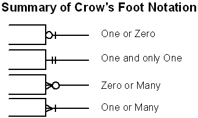
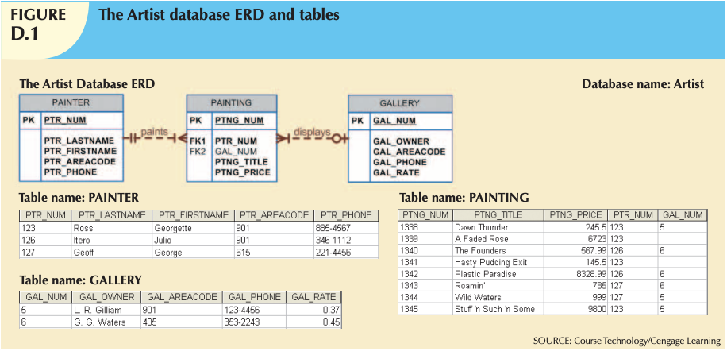
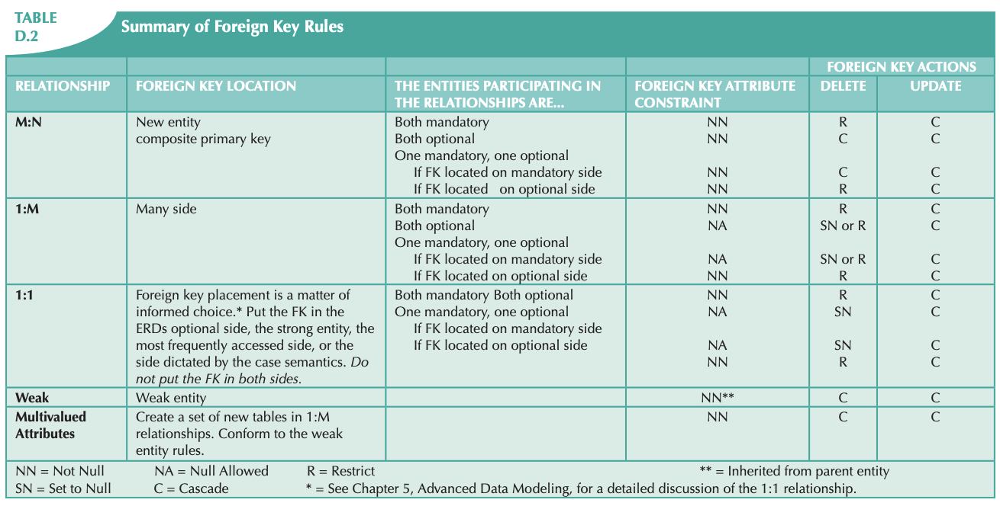

<!-- 

📋 This is the tech-news archives to help me keep track of what I am interested in!

- Reference tech news link: <https://thenextweb.com/news/blockchain-development-tech-career>
  

<div class="notice--danger">{{ notice-2 | markdownify }}</div> -->

📋 This is my note-taking from what I learned in the class "Introduction To Database Concept"
{: .notice--danger}

<br>



Keywords!

- Meta Data: Information about the data
- Primary Key: Only one in a table, cannot be null and duplicate
- Foreign Key: One (or) Many in a table, can be null and duplicate
- Crow Foot Notation: 
  

<div class="notice--danger">{{ notice-2 | markdownify }}</div>

<br>

# The Artist Database ERD and Tables



To illustrate the conversion of an ER model into a database structure, Use the Artist database.

- A painter might paint many paintings. To be considered a painter in the Artist database, the painter must have painted at least one painting. This business rule decrees that the cardinality is (1,N) in the relationship between PAINTER and PAINTING.
- Each painting is painted by one (and only one) painter.
- A painting might (or might not) be exhibited in a gallery; that is, GALLERY is an optional entity to the PAINTING entity.


The data dictionary in Table D.1 shows the characteristics of the attributes found in the three tables.

Given the information in Figure D.1 and Table D.1, note that:

- PTR_NUM in the PAINTING table is the foreign key that references the PAINTER table. Because the relationship between PAINTER and PAINTING is mandatory, the PTR_NUM foreign key must be classified as NOT NULL.
- GAL_NUM in PAINTING is the foreign key that references the GALLERY table. Because the relationship between PAINTING and GALLERY is optional, the GAL_NUM foreign key may be null.

<br>

# The Effect of Foreign Key Constraints on Data Manipulation

1. Adding a painter (row) to the PAINTER table. Adding a painter does not cause any problems because the PAINTER table does not have any dependencies in other tables.
2. Updating the PAINTER table’s primary key. Changing a PAINTER key causes problems in the database because some paintings in the PAINTING table may make reference to this key. The option is to use the UPDATE CASCADE. This option makes sure that a change in the PAINTER’s PTR_NUM automatically triggers the required changes in the PTR_NUM foreign key found in other tables. This is the recommended option. This behavior (UPDATE CASCADE) is not supported by some RDBMS products, such as Oracle.
3. Deleting a painter (row) from the PAINTER table. If you delete a row (painter) from the PAINTER table, the PAINTING table may contain references to a painter who no longer exists, thereby creating a deletion anomaly. (A painting does not cease to exist just because the painter does.) Given this situation, it is wise to restrict the ability to delete a row from a table when there is a foreign key in another table that references the row. The restriction means that you can delete a painter from the PAINTER table only when there is no foreign key in another table related to this painter row. This behavior is enforced automatically by the RDBMS when using the FOREIGN KEY clause.
4. Adding a gallery (row) to the GALLERY table. Adding a new row does not affect the database because the GALLERY does not have dependencies in other tables.
5. Updating the GALLERY table’s primary key. Changing a primary key value in a GALLERY row requires that all foreign keys making reference to it be updated as well. Therefore, you must use an UPDATE CASCADE clause. This option makes sure that a change in the GALLERY’s GAL_NUM automatically triggers the required changes in the GAL_NUM foreign key found in other tables. This is the recommended option. This behavior (UPDATE CASCADE) is not supported by some RDBMS products, such as Oracle.
6. Deleting a gallery (row) from the GALLERY table. Deleting a GALLERY row creates problems in the database when rows in the PAINTING table make reference to the GALLERY row’s primary key. Because GALLERY is optional to PAINTING, you may set all of the deleted gallery GAL_NUM values to null (DELETE SET NULL). Or you may want the database user to be alerted to the problem by specifying that the deletion of a GALLERY row is permitted only when there is no foreign key (GAL_NUM) in another table that requires the GALLERY row’s existence. This behavior is enforced automatically by the RDBMS when using the FOREIGN KEY clause.

<br>

# Transforming the ER Model into a Set of Tables

Armed with the results discussed in Section D.1.1, you can now transform the ER model into a set of tables by using the following SQL commands:

## 1. Create the PAINTER table:

```
CREATE TABLE PAINTER (
PTR_NUM      CHAR(4)   NOT NULL   UNIQUE,
PTR_LASTNAME           CHAR(15)   NOT NULL,
PTR_FIRSTNAME          CHAR(15)   NOT NULL,
PTR_AREACODE           CHAR(3),
PTR_PHONE              CHAR(8),
PRIMARY KEY (PTR_NUM));
```

## 2. Create the GALLERY table:

```
CREATE TABLE GALLERY (
GAL_NUM       CHAR(4)     NOT NULL   UNIQUE,
GAL_OWNER     CHAR(35),
GAL_AREACODE  CHAR(3)     NOT NULL,
GAL_PHONE     CHAR(8)     NOT NULL,
GAL_RATE      NUMBER(4,2),
PRIMARY KEY (GAL_NUM));
```

## 3. Create the PAINTING table:

```
CREATE TABLE PAINTING (
PTNG_NUM      CHAR(4)       NOT NULL   UNIQUE,
PTNG_TITLE    CHAR(35),
PTNG_PRICE    NUMBER(9,2),
PTR_NUM       CHAR(4)       NOT NULL,
GAL_NUM       CHAR(4),
PRIMARY KEY(PNTG_NUM),
FOREIGN KEY (PTR_NUM) REFERENCES PAINTER
ON UPDATE CASCADE,
FOREIGN KEY (GAL_NUM) REFERENCES GALLERY
ON UPDATE CASCADE);
```

After creating the database tables and entering their contents, you are now ready for data entry, queries, and reports. Note that the decisions made by the designer to govern data integrity are reflected in the foreign key rules. Implementation decisions vary according to the problem being addressed.

<br>

# General Rules Governing Relationships among Tables

Given the experience with the simple Artist database in the previous section, here is a general set of rules to help you create any database table structure that will meet the required integrity constraints.

1. All primary keys must be defined as NOT NULL and UNIQUE. If your applications software does not support the NOT NULL option, you should enforce the condition by using programming techniques. This is another argument for using DBMS software that meets ANSI SQL standards.
2. Define all foreign keys to conform to the following requirements for binary relationships.

## 1:M Relationships

Create the foreign key by putting the primary key of the “one” in the table of the “many.” The “one” side is referred to as the parent table, and the “many” side is referred to as the dependent table. Observe the following foreign key rules:

<u>If both sides are MANDATORY:</u>

```
Column constraint: NOT NULL
FK constraint:     Default behavior (on delete restrict)
                   ON UPDATE CASCADE
```

<u>If both sides are OPTIONAL:</u>

```
Column constraint: NULL ALLOWED
FK constraint:     ON DELETE SET NULL
                   ON UPDATE CASCADE
```

<u>If one side is OPTIONAL and one side is MANDATORY:</u>

a. If the “many” and the mandatory components of the relationship are on the same side in the ER diagram, a NULL ALLOWED condition must be defined for the dependent table’s foreign key. The foreign key rules
should be:

```
Column constraint: NULL ALLOWED
FK constraint:     ON DELETE SET NULL or
                   default behavior: ON DELETE RESTRICT
                   ON UPDATE CASCADE
```

b. If the “many” and the mandatory components of the relationship are not on the same side in the ER diagram, a NOT NULL condition must be defined for the dependent table’s foreign key. Deletion and update in the parent table of the foreign key should be subject to default behavior (on delete restrict) and UPDATE CASCADE restrictions.

## Weak Entities

a. Put the key of the parent table (the strong entity) in the weak entity. The key of the weak entity will be a composite key composed of the parent table key and the weak entity candidate key, if any. (The designer may decide to create a new unique ID for the entity.)

b. The weak entity relationship conforms to the same rules as the 1:M relationship, except for the following foreign key restrictions:

```
Column constraint: NOT NULL
FK constraint:     ON DELETE CASCADE
                   ON UPDATE CASCADE
```

## M:N Relationships

Convert the M:N relationship to a composite (bridge) entity consisting of (at least) the parent tables’ primary keys. Thus, the composite entity primary key is a composite key that is subject to the NOT NULL restriction.

## 1:1 Relationships

If both entities are in a mandatory participation in the relationship and they do not participate in other relationships, it is most likely that the two entities should be part of the same entity.

<br>



Table D.2 summarizes the ramifications of the foreign key actions that could be used to represent multiple cases of 1:1, 1:M, and M:N relationships.

<br>

# Week 02 Demo

```
SELECT * FROM CUSTOMERS;
SELECT * FROM ORDERS;
SELECT * FROM PUBLISHER;
SELECT * FROM BOOKS;

-- LIST OF CUSTOMERS FROM CHICAGO
SELECT * FROM CUSTOMERS WHERE CITY ='CHICAGO';
select * from customers where city ='CHICAGO';

-- THIS WILL NOT DISPLAY ANY RESULTS
SELECT * FROM CUSTOMERS WHERE CITY ='chicago';

-- LIST OF CUSTOMERS FROM MIAMI AND CHICAGO
SELECT * FROM CUSTOMERS WHERE CITY ='MIAMI' OR CITY ='CHICAGO';

-- LIST OF CUSTOMERS REFERRED BY OTHER CUSTOMERS
SELECT * FROM CUSTOMERS WHERE referred IS NOT NULL;

-- LIST OF CUSTOMERS NOT REFERRED BY OTHER CUSTOMERS
SELECT * FROM CUSTOMERS WHERE referred IS NULL;

-- LIST OF CUSTOMERS NOT REFERRED BY OTHER CUSTOMERS FROM NE
SELECT * FROM CUSTOMERS WHERE REFERRED IS NOT NULL AND REGION ='NE';

-- DETAILS OF CUSTOMER 1003
SELECT * FROM CUSTOMERS WHERE CUSTOMER# = 1003;

-- LIST OF BOOKS FROM COMPUTER CATEGORY
SELECT * FROM BOOKS WHERE CATEGORY ='COMPUTER';

-- LIST OF BOOKS WHICH HAS DISCOUNT
SELECT * FROM BOOKS WHERE DISCOUNT IS NOT NULL;

-- LIST OF BOOKS FROM COMPUTER AND CHILDREN CATEGORY
SELECT * FROM BOOKS WHERE CATEGORY ='COMPUTER' OR CATEGORY ='CHILDREN';

-- LIST OF BOOKS FROM COMPUTER AND CHILDREN CATEGORY WHICH HAS DISCOUNT
SELECT * FROM BOOKS WHERE (CATEGORY ='COMPUTER' OR CATEGORY ='CHILDREN') AND DISCOUNT IS NOT NULL;

-- DUMMY TABLE = DUAL TABLE
SELECT (2+3)*4+1 FROM DUAL;
SELECT (2+3*4+1) FROM DUAL;
SELECT (2+3)*(4+1) FROM DUAL;
SELECT SYSDATE FROM DUAL;
SELECT 'SEYEON' FROM DUAL;

-- LIST OF CUSTOMERS FROM WHOSE ID IS 1001 TO 1010
SELECT * FROM CUSTOMERS WHERE CUSTOMER# BETWEEN 1001 AND 1010;
SELECT * FROM CUSTOMERS WHERE CUSTOMER# >= 1001 AND CUSTOMER# <= 1010;

-- BOOKS THAT ARE MORE THAN $20
SELECT * FROM BOOKS WHERE COST >= 20;

-- BOOKS THAT ARE $20 TO $50
SELECT * FROM BOOKS WHERE COST BETWEEN 20 AND 50;
SELECT * FROM BOOKS WHERE COST >= 20 AND COST <= 50;

-- EXCEPT COMPUTER CATEGORY DISPLAY ALL OTHER BOOKS
-- NOT EQUAL: != & <>
SELECT * FROM BOOKS WHERE CATEGORY != 'COMPUTER';
SELECT * FROM BOOKS WHERE CATEGORY <> 'COMPUTER';
```

<br>

# C.2 Demo

```
-- Week 02 --

-- LIST OF CUSTOMERS FROM CHICAGO AND MIAMI
SELECT * FROM CUSTOMERS WHERE CITY ='CHICAGO' OR CITY ='MIAMI';
-- LIST OF CUSTOMERS REFERED BY OTHER CUSTOMERS
SELECT* FROM CUSTOMERS WHERE REFERRED IS NOT NULL;
-- LIST OF CUSTOMERS WHO ARE NOT REFERED BY OTHER CUSTOMERS FROM NE
SELECT * FROM CUSTOMERS WHERE REFERRED IS NULL AND REGION='NE';
-- LOGICAL ERROR
SELECT * FROM CUSTOMERS WHERE REFERRED = NULL;

-- DETAILS OF CUSTOMER# 1003
SELECT * FROM CUSTOMERS WHERE CUSTOMER# = 1003;

-- LIST OF BOOKS FROM COMPUTER CATEOGORY
SELECT * FROM BOOKS WHERE CATEGORY ='COMPUTER';
-- LIST OF BOOKS FROM COMPUTER AND CHILDEREN CATEGROY WHICH HAS DISCOUNT
SELECT * FROM BOOKS WHERE (CATEGORY='COMPUTER' OR CATEGORY='CHILDREN') AND DISCOUNT IS NOT NULL;

-- CALCULATE THE EXPRESSION AND RETRIEVE THE RESULT FROM 'DUAL' TABLE
SELECT (2+3) * (4+1) FROM DUAL;
-- CROSS CHECK PROFIT
SELECT 30.95-18.75 FROM DUAL;

-- GET THE RESULT FROM 'DUAL' TABLE
--> 'DUAL' TABLE => USED FOR SELELECTING SYSTEM-LEVEL VALUES OR PERFORMING CALCULATIONS WITHOUT ACCESSING ANY SPECIFIC TABLE
SELECT SYSDATE FROM DUAL;
SELECT 'VIJI' FROM DUAL;
SELECT 'MAY-16-2023' FROM DUAL;

-- LIST OF CUSTOMERS WHOSE ID IS FROM '1001' TO '1010'
SELECT * FROM CUSTOMERS WHERE CUSTOMER# BETWEEN 1001 AND 1010;
SELECT * FROM CUSTOMERS WHERE CUSTOMER#>=1001 AND CUSTOMER#<=1010;

-- BOOKS THAT COSTS ARE MORE THAN $20
SELECT * FROM BOOKS WHERE COST>=20;
-- BOOKS THAT COSTS ARE FROM $20 TO $ 50
SELECT * FROM BOOKS WHERE COST>=20 AND COST<=50;

-- DISPLAY ALL OTHER BOOKS EXCEPT 'COMPUTER' CATEGROY
--> USE != OR <>
SELECT * FROM BOOKS WHERE CATEGORY != 'COMPUTER';
SELECT * FROM BOOKS WHERE CATEGORY <> 'COMPUTER';
```

<br>

---

<br>

[Back to Top](#){: .btn .btn--primary }{: .align-right}
