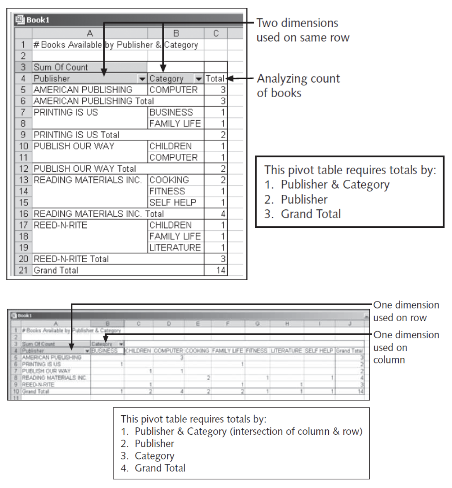
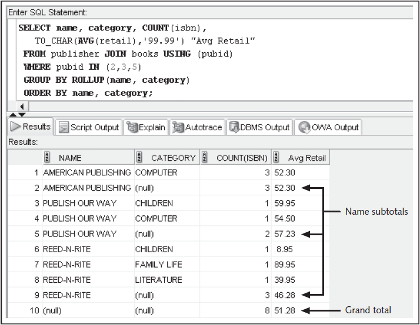



📋 This is my note-taking from what I learned in the class "Introduction To Database Concept"

- Reference link - SQL Oracle Function: <https://docs.oracle.com/cd/B19306_01/server.102/b14200/functions001.htm>
  

<div class="notice--danger">{{ notice-2 | markdownify }}</div>

<!-- 📋 This is my note-taking from what I learned in the class "Introduction To Database Concept"
{: .notice--danger} -->

<br>

# Group Functions

- Return one result per group of rows processed
- Are also called multiple-row and aggregate functions
- All group functions ignore `NULL` values except `COUNT(*)`
- Use `DISTINCT` to suppress duplicate values.

<br>

# Added Clauses

```
SELECT *|COLUMNNAME, COLUMNNAME, ...
FROM TABLENAME
[WHERE CONDITION]
[GROUP BY COLUMNNAME, COLUMNNAME, ...]
[HAVING GROUP CONDITION];
```

## SUM Function

Calculates total amount stored in a numeric column for a group of rows

```
SELECT SUM((PAIDEACH-COST) * QUANTITY) "TOTAL PROFIT"
  FROM ORDERITEMS JOIN BOOKS USING (ISBN)
  WHERE ORDER# = 1007;
```

## AVG Function

Calculates the average of numeric values in a specified column

```
SELECT AVG(RETAIL-COST) "AVERAGE PROFIT"
  FROM BOOKS
  WHERE CATEGORY = 'COMPUTER';
```

## COUNT Function

Two purposes:

- Count non-NULL values
- Count total records, including those with NULL values

## COUNT Function – Non-NULL Values

Include column name in argument to count number of occurrences

```
SELECT COUNT(DISTINCT CATEGORY)
  FROM BOOKS;
```

## COUNT Function – NULL Values

Include asterisk in argument to count number of rows

```
SELECT COUNT(*)
  FROM ORDERS
  WHERE SHIPDATE IS NULL;
```

## MAX Function

Returns the largest value

```
SELECT MAX(RETAIL-COST) "HIGHEST PROFIT"
  FROM BOOKS;
```

## MIN Function

Returns the smallest value

```
SELECT MIN(PUBDATE)
  FROM BOOKS;
```

<br>

# Datatypes

The COUNT, MIN, and MAX functions can be used on values with character, numeric, and date datatypes

<br>

# Grouping Data

GROUP BY clause:

- Used to group data
- Must be used for any individual column in the SELECT clause with a group function
- Cannot reference column aliases

```
SELECT CATEGORY, TO_CHAR(AVG(RETAIL-COST), '999.99') "PROFIT"
  FROM BOOKS
  GROUP BY CATEGORY;
```

## Common Error

A common error is missing a GROUP BY clause for non-aggregated columns in the SELECT clause

```
SELECT CATEGORY, TO_CHAR(AVG(RETAIL-COST), '999.99') "PROFIT"
  FROM BOOKS;

# An error was encountered performing the requested operation:
# not a single-group group function
```

<br>

# Restricting Aggregating Output

HAVING clause serves as the WHERE clause for grouped data

```
SELECT CATEGORY, TO_CHAR(AVG(RETAIL-COST), '999.99') "PROFIT"
  FROM BOOKS
  GROUP BY CATEGORY
  HAVING AVG(RETAIL-COST) > 15;
```

When included in the same SELECT statement, the clauses are evaluated in the order of:

- WHERE
- GROUP BY
- HAVING

```
SELECT CATEGORY, TO_CHAR(AVG(RETAIL-COST), '999.99') "PROFIT"
  FROM BOOKS
  WHERE PUBDATE > '01-JAN-05'
  GROUP BY CATEGORY
  HAVING AVG(RETAIL-COST) > 15;
```

## Nesting Functions

Inner function is resolved first

```
SELECT AVG(SUM(QUANTITY * PAIDEACH)) "AVERAGE ORDER TOTAL"
  FROM ORDERS JOIN ORDERITEMS USING (ORDER#)
  GROUP BY ORDER#;
```

Maximum nesting depth: 2

<br>

# Statistical Group Functions

Based on normal distribution

Includes:

- STDDEV
- VARIANCE

## STDDEV Function

```
SELECT CATEGORY, COUNT(*), TO_CHAR(AVG(RETAIL-COST), '999.99') "AVG", TO_CHAR(STDDEV(RETAIL-COST), '999.9999') "STDDEV"
  FROM BOOKS
  GROUP BY CATEGORY;
```

## VARIANCE Function

Determines data dispersion within a group

```
SELECT CATEGORY, TO_CHAR(VARIANCE(RETAIL-COST), '999.99') "VAR", MIN(RETAIL-COST) "MIN", MAX(RETAIL-COST) "MAX"
  FROM BOOKS
  GROUP BY CATEGORY;
```

<br>

# Enhanced Aggregation for Reporting

Oracle provides extensions to the GROUP BY clause, which allow both aggregation across multiple dimensions or the generation of increasing levels of subtotals with a single SELECT statement

A dimension is a term used to describe any category used in analyzing data, such as time, geography, and product line

Each dimension could contain various levels of aggregation; for example, the time dimension may include aggregation by month, quarter, and year

## Excel Pivot Table Example



<br>

# Grouping Sets

```
SELECT NAME, CATEGORY, COUNT(ISBN), TO_CHAR(AVG(RETAIL), '99.99') "AVG RETAIL"
  FROM PUBLISHER JOIN BOOKS USING (PUBID)
  WHERE PUBID IN (2,3,5)
  GROUP BY GROUPING SETS(NAME, CATEGORY, (NAME, CATEGORY), ());
```


## CUBE

```
SELECT NAME, CATEGORY, COUNT(ISBN), TO_CHAR(AVG(RETAIL), '99.99') "AVG RETAIL"
  FROM PUBLISHER JOIN BOOKS USING (PUBID)
  WHERE PUBID IN (2,3,5)
  GROUP BY CUBE(NAME, CATEGORY)
  ORDER BY NAME, CATEGORY;
```

## ROLLUP

```
SELECT NAME, CATEGORY, COUNT(ISBN), TO_CHAR(AVG(RETAIL), '99.99') "AVG RETAIL"
  FROM PUBLISHER JOIN BOOKS USING (PUBID)
  WHERE PUBID IN (2,3,5)
  GROUP BY ROLLUP(NAME, CATEGORY)
  ORDER BY NAME, CATEGORY;
```



## PATTERN MATCHING

```
SELECT *
  FROM WEBHITS MATCH_RECOGNIZE (
    PARTITION BY WPAGE
    ORDER BY WHDATE
    MEASURES STRT.WHDATE AS BEGIN_WDATE,
            LAST(DOWN.WHDATE) AS LOW_WDATE,
            LAST(UP.WHDATE) AS END_WDATE
    ONE ROW PER MATCH
    AFTER MATCH SKIP TO LAST UP
    PATTERN (STRT DOWN+ UP+)
    DEFINE
      DOWN AS DOWN.TOTAL < PREV(DOWN.TOTAL),
      UP AS UP.TOTAL > PREV(UP.TOTAL)
  ) WH
  ORDER BY WH.WPAGE, WH.BEGIN_WDATE;
```

<br>

# Summary

- The AVG, SUM, STDDEV, and VARIANCE functions are used only with numeric fields
- The COUNT, MAX, and MIN functions can be applied to any datatype
- The AVG, SUM, MAX, MIN, STDDEV, and VARIANCE functions all ignore NULL values
- By default, the AVG, SUM, MAX, MIN, COUNT, STDDEV, and VARIANCE functions include duplicate values
- The GROUP BY clause is used to divide table data into groups
- If a SELECT clause contains both an individual field name and a group function, the field name must also be included in a GROUP BY clause
- The HAVING clause is used to restrict groups in a group function
- Group functions can be nested to a depth of only two. The inner function is always performed first, using the specified grouping. The results of the inner function are used as input for the outer function
- The STDDEV and VARIANCE functions are used to perform statistical analyses on a set of data
- GROUPING SETS operations can be used to perform multiple GROUP BY aggregations with a single query
- The CUBE extension of the GROUP BY calculates aggregations for all possible combinations or groupings of columns included
- The ROLLUP extension of the GROUP BY calculates increasing levels of accumulated subtotals for the column list provided
- Composite columns and concatenated groupings can be used in GROUPING SETS, CUBE, and ROLLUP operations
- The GROUP_ID function helps eliminate duplicate grouping results

<br>

# C.12 Demo

```
SELECT RETAIL-COST  FROM BOOKS;

--Returns total value . ignore  null values
SELECT SUM(RETAIL-COST) FROM BOOKS;

-- calculate the avg price of cooking books
SELECT AVG(RETAIL-COST) FROM BOOKS WHERE CATEGORY ='COOKING';

SELECT RETAIL-COST FROM BOOKS WHERE CATEGORY ='COOKING';
-- Count number of books .Rows containing NULL values in the field aren�t included in the results.
SELECT COUNT(*) FROM books;

SELECT COUNT(shipdate) FROM orders;
select shipdate from orders;

SELECT COUNT(* ) FROM orders;

-- select the highest value. Ignores null values
select customer#   from customers ;
SELECT MAX(customer#) from customers;

-- select the lowerst value from the selected field
SELECT MIN(RETAIL-COST) FROM BOOKS;

SELECT CATEGORY,MIN(RETAIL-COST) FROM BOOKS GROUP BY category;
SELECT CATEGORY,MIN(RETAIL-COST) FROM BOOKS group by CATEGORY;
-- Having clause - only for grouping function .
SELECT category,AVG(RETAIL-COST) FROM BOOKS GROUP BY CATEGORY  HAVING AVG(RETAIL-COST) >20;

SELECT category,AVG(RETAIL-COST) FROM BOOKS GROUP BY CATEGORY  HAVING AVG(RETAIL-COST) >15;

--Enables performing multiple GROUP BY operations with a single query
SELECT name, category, AVG(retail) FROM publisher JOIN books USING(pubid) GROUP BY GROUPING SETS (name, category, (name,category), ());


--Performs aggregations for all possible combinations of columns included.
SELECT name, category, AVG(retail) FROM publisher JOIN books USING(pubid) GROUP BY CUBE(name, category) ORDER BY name, category;

--Performs increasing levels of cumulative subtotals, based on the specified column list
SELECT name, category, AVG(retail) FROM publisher JOIN books USING(pubid) GROUP BY ROLLUP(name, category) ORDER BY name, category;
```

<br>

---

<br>

[Back to Top](#){: .btn .btn--primary }{: .align-right}
