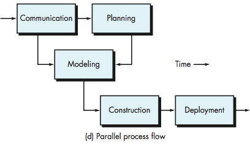
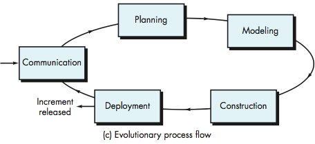

<!-- 

📋 This is the tech-news archives to help me keep track of what I am interested in!

- Reference tech news link: <https://thenextweb.com/news/blockchain-development-tech-career>
  

{{ notice-2 | markdownify }}
 -->

📋 This is my note-taking from what I learned in the class "Software Requirements Engng"
{: .notice--danger}

 

# What is the software process?

The software Process:

- Provides framework for the activities, actions, and tasks required to build high quality software.
- Defines the approach taken as software is engineered.
- Adapts by creative, knowledgeable software engineers so that it is appropriate for the products they build and the demands of the marketplace.

 

# What is a process flow?

The process flow describes how each of the five framework activities, actions, and tasks are organized with respect to sequence and time four options:

- Linear Process Flow
  : 
  : Executes each of the framework activities in order beginning with communication and ending with deployment.
- Iterative Process Flow
  : 
  : Executes the activities in a circular manner creating a more complete version of the software with each circuit or iteration.
- Parallel Process Flow
  : 
  : Executes one on more activities in parallel with other activities.
- Evolutionary Process Flow
  : 
  : Executes the activities in a “circular” manner. Each circuit through the five activities leads to a more complete version of the software.

 

# Process Assessment and Improvement

Important standards for Process Assessment and Improvement:

- Standard CMMI Assessment Method for Process Improvement (SCAMPI) provides a five step process assessment model that incorporates five phases (initiating, diagnosing, establishing, acting, learning)
- CMM-Based Appraisal for Internal Process Improvement (CBAIPI) provides diagnostic technique for assessing the relative maturity of a software organization
- SPICE (ISO/IE15504) standard defines a set of requirements for process assessment
- ISO 9001:2000 for Software defines requirements for a quality management system that will produce higher quality products and improve customer satisfaction

 

---

 

[Back to Top](#){: .btn .btn--primary }{: .align-right}
