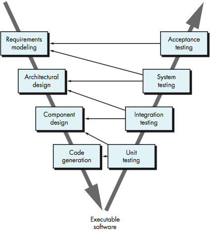
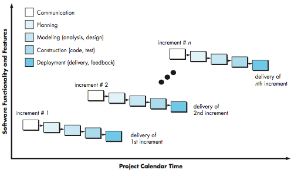
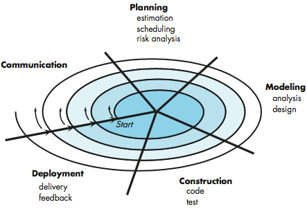
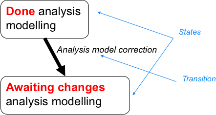

<!-- 

📋 This is the tech-news archives to help me keep track of what I am interested in!

- Reference tech news link: <https://thenextweb.com/news/blockchain-development-tech-career>
  

{{ notice-2 | markdownify }}
 -->

📋 This is my note-taking from what I learned in the class "Software Requirements Engng"
{: .notice--danger}

 

# Overview

The purpose of process models is to try to reduce the chaos present in developing new software products.

A software process model defines:

- The flow of all activities, actions and tasks.
- The degree of iterations.
- The work products.
- The organization of the work that must be done.

 

# Perspective process models

These models strive for structure and order in the development process.

- Activities and tasks occur sequentially with defined guidelines.
- They are called perspective because they prescribe a set of process elements, activities, actions, tasks, work products, quality assurance and change control procedures for every project.
- Originally proposed to bring order to the chaos of software development.
- They brought to software engineering work and provide reasonable guidance to software teams.
- They have not provided a definitive answer to the problems of software development in an ever-changing computing environment.
- Work well when the requirements are clear.

## The Waterfall Model

- The oldest paradigm for software engineering.
- Works well when requirements for a problem are well understood.
- Can be applied when enhancements are required for an existing system.
  : Examples
  : - An enhancement to an accounting software that has been mandated because of government changes.
  : - An enhancement to an ATM messaging system because of a new VISA mandate on the level of message exchange.
- Can be applied to new developments but only when the requirements are well defined.

## The V-model

A variation in the representation of the waterfall model. The V-model depicts (illustrates) the relationship between the quality assurance actions and the actions related to communications, modelling and early construction.

Problems that might occur when applying the waterfall model:

- Real projects rarely follow the sequential flow that the model proposes. Although the linear model can accommodate iteration, it does so indirectly. As a result, changes can cause confusion as the project team proceeds.
- It is often difficult for the customer to state all requirements explicitly. The waterfall model requires this and has difficulty accommodating the natural uncertainty that exists at the beginning of many projects.
- The customer must have patience. A working version of the program(s) will not be available until late in the project time span.

## The Incremental process model

- Works well when initial software requirements are reasonably well defined but overall scope of development prevents a linear process.
- Works well when there is a need to provide a limited set of functionalities to users quickly.
- Deliver software in small but usable pieces, each piece builds on pieces already delivered.
- The incremental model combines the elements of linear and parallel processes.
- When an incremental model is used, the first increment is often a core product.

 

# Evolutionary process models

These models are considered by many to be the best approach to software development in a modern context. Because time lines for the development of modern software are getting shorter and shorter, customers are becoming more diverse (making the understanding of requirements even harder), and changes to requirements are becoming even more common (before delivery).

- The evolutionary process accommodates uncertainty better than most process models, allows the delivery of partial solutions in an orderly and planned manner, and most importantly, reflects what really happens when complex systems are built.
- Evolutionary process models are iterative in nature.
- Two common evolutionary process models are the prototype model and the spiral model.

## Prototyping

- Work well when the customer has a need but is clueless about the details.
- Can be used as a stand-alone, but it is more commonly used as a technique within the context of any other process.
- Developer needs to resist pressure to extend a rough prototype into a production product. Quality will suffer.

## The spiral model

- Couples iterative nature of prototyping with the controlled and systematic aspects of the Waterfall Model.
- The model uses the concept of circuits, each circuit has a start point and produces a deliverable which could be a product specification or a prototype or a working set of functionalities.
- The spiral model can be adopted to apply throughout the entire life-cycle of an application, from concept development to maintenance. In essence, the spiral model remains operative until the software is retired.
- The spiral model is realistic approach to the development of large scale systems and software, because software evolves as the process progresses so the developer and the customer can react to the risks that evolve.
- The spiral model uses prototyping as a risk reduction mechanism.
- Spiral models do not work well with fixed budget projects, because with every circuit a re-plan is produced which results in the adjustment of cost, schedule and project plan.

 

# Concurrent process models

Concurrent Development Model also known as concurrent engineering - allows software teams to represent the iterative and concurrent element of any process model.

- Concurrent models define a series of events that will trigger a transition from one state to another for each of the activities, actions or tasks. Accordingly, each state would be an activity, action or task represented by a rounded rectangle and the arrows would be the triggering events that cause the movements.

For example:

If one of the actions is to complete the analysis model and the action is completed then the state of this action is done. If for some reason an inconsistency in the analysis model then this would trigger re-opening this action to revisit the inconsistency, as per the below diagram.

 

# Specialized process models

Specialized process models take on many of the characteristics of one or more of the traditional models presented in the preceding sections. However, these models tend to be applied when a specialized or narrowly defined software engineering approach is chosen.

## Component-Based Development:

Spiral model variation in which applications are built from prepackaged software components called classes

- The model leads to software reuse which leads to a reduction in the development cycle time and if component reuse is adopted in the organization, a reduction in the cost.
- Follows the following five steps:
  : - Available component-based products are researched and evaluated for the application domain in question.
  : - Component integration issues are considered.
  : - A software architecture is designed to accommodate the components.
  : - Components are integrated into the architecture.
  : - Comprehensive testing is conducted to ensure proper functionality.

## Formal Methods Model:

Rigorous mathematical notation used to specify, design, and verify computer-based systems:

- Not widely adopted because of the following:
  : - The development of formal models is currently quite time consuming and expensive.
  : - Because few software developers have the necessary background to apply formal methods, extensive training is required.
  : - It is difficult to use the models as a communication mechanism for technically unsophisticated customers.
- Applied for safety - critical software for example: Aircraft software or Medical software

## Aspect-Oriented Software Development:

Aspect-oriented programming - provides a process for defining, specifying, designing, and constructing software aspects like user interfaces, security, and memory management that impact many parts of the system being developed:

- Fairly new and a distinct process has not yet matured.

 

# The unified process model

- Use-case driven, architecture centric, iterative, and incremental software process
- Attempts to draw on best features of traditional software process models and implements many features of agile software development
- Phases
  : - Inception phase (customer communication and planning)
  : - Elaboration phase (communication and modeling)
  : - Construction phase
  : - Transition phase (customer delivery and feedback)
  : - Production phase (software monitoring and support)

 

# Personal and team process model

## Personal and process model

- Emphasizes personal measurement of both work products and the quality of the work products
- Stresses importance of identifying errors early and to understand the types of errors likely to be made
- Framework activities
  : - Planning: size and resource estimates based on requirements.
  : - High-level design: external specifications developed for components and component level design is created.
  : - High-level design review: formal verification methods used to uncover design errors, metrics maintained for important tasks.
  : - Development component level design refined, code is generated, reviewed, compiled, and tested, metric maintained for important tasks and work results.
  : - Postmortem effectiveness of processes is determined using measures and metrics. collected, results of analysis should provide guidance for modifying the process to improve its effectiveness.

## Team process model

- Objectives
  : - Build self-directed teams that plan and track their work, establish goals, and own their processes and plans
  : - Show managers how to coach and motivate their teams and maintain peak performance
  : - Accelerate software process improvement by making CCM Level 5 behavior normal and expected
  : - Provide improvement guidance to high-maturity organizations
  : - Facilitate university teaching of industrial team skills
- Scripts for Project Activities
  : - Project launch
  : - High Level Design
  : - Implementation
  : - Integration and system testing
  : - Postmortem

 

# Process technology tools

- Used to adapt process models to be used by software project team
- Allow organizations to build automated models of common process framework, task sets, and umbrella activities
- These automated models can be used to determine workflow and examine alternative process structures
- Tools can be used to allocate, monitor, and even control all software engineering tasks defined as part of the process model

 

---

 

[Back to Top](#){: .btn .btn--primary }{: .align-right}
