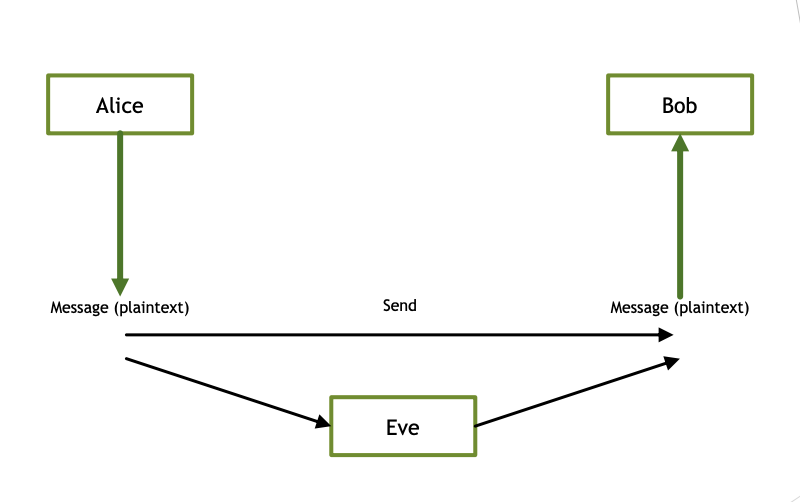
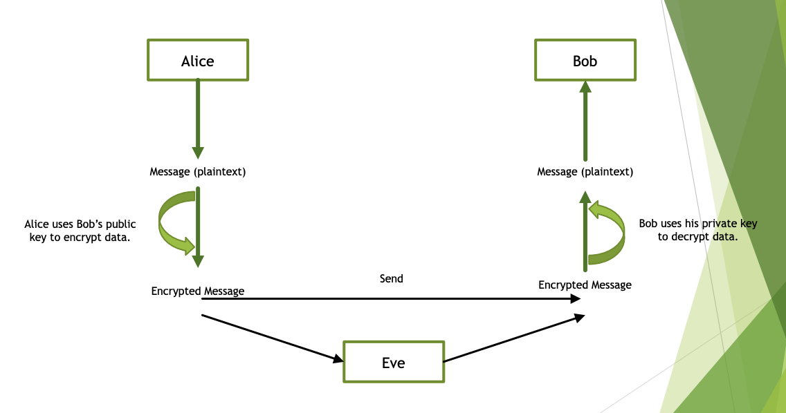
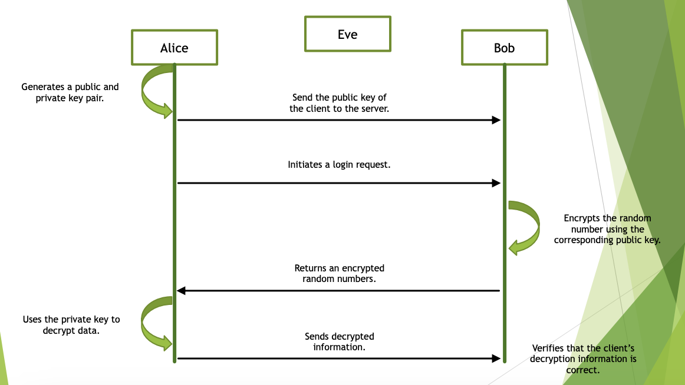
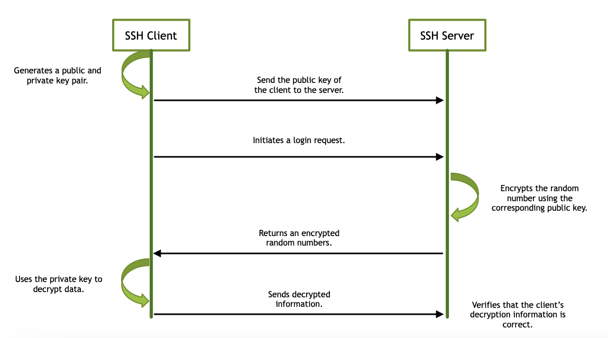

<!-- 

📋 This is my note-taking from what I learned in the Unix/Linux Tutorial!

- Reference link: <https://www.tutorialspoint.com/unix/index.htm>
  

{{ notice-2 | markdownify }}
 -->



📋 This is my note-taking from what I learned in the Unix/Linux course!


{{ notice-2 | markdownify }}

<!-- 📋 This is my note-taking from what I learned in the UNIX/LINUX Tutorial!
{: .notice--danger} -->

 

# Encryption

At its most basic level, encryption is the process of protecting information or data by using mathematical models to scramble it in such a way that only the parties who have the key to unscramble it can access it.<https://cloud.google.com/learn/what-is-encryption>

## No Security

## Public Key Encryption

## No security

 

# SSH

SSH

# What is SSH?

- SSH (Secure Shell) is a cryptographic network protocol that provides a secure and encrypted communication channel between a client and a server over an unsecured network. It ensures the confidentiality, integrity, and authenticity of the data transmitted between the two parties.
- It provides secure remote access to servers and systems.
- It is an essential tool for administrators, developers, and users who require secure and authenticated connections for managing remote systems.
- OpenSSH is known for its robust security features and its ability to protect sensitive data during transmission.

## How does it Work?

1. Establishing the Connection:
   : - The client initiates a connection to the SSH server using the SSH protocol.
   : - The server listens for incoming SSH connections on a specific port (usually port 22).
   : - The client and server perform a handshake process to establish a secure connection.
2. Key Exchange:
   : - During the handshake process, the client and server negotiate encryption algorithms, session keys, and other parameters for the secure connection.
   : - They perform a Diffie-Hellman key exchange or an elliptic curve Diffie-Hellman (ECDH) key exchange to securely generate a shared secret key without transmitting it over the network.
   : - The shared secret key is used for encrypting and decrypting the data exchanged between the client and server.
3. User Authentication:
   : - Once the secure connection is established, the client needs to authenticate itself to the server.
   : - SSH supports multiple authentication methods, including password-based authentication, public key authentication, and keyboard-interactive authentication.
   : - Password-based authentication involves the client sending the user's password to the server, which verifies it.
   : - Public key authentication uses a key pair (public key and private key) where the client presents its public key to the server, and the server verifies it using the corresponding private key.
   : - Keyboard-interactive authentication allows for custom challenges and responses between the client and server.
4. Encrypted Communication:
   : - After successful authentication, the client and server start exchanging encrypted data.
   : - All data transmitted between the client and server, including commands, file transfers, and output, is encrypted using the negotiated encryption algorithms and session keys.
   : - This encryption ensures that even if someone intercepts the data, they cannot decipher its contents.
5. Secure Remote Access and Data Transfer:
   : - With the secure connection established, the client can remotely execute commands on the server, access files, and perform various operations securely.
   : - SSH provides features like terminal emulation, allowing the client to interact with the server's command-line interface remotely.
   : - SSH also includes utilities like SCP (Secure Copy) and SFTP (Secure File Transfer Protocol) for secure file transfer between the client and server.
6. Session Termination:
   : - When the client is done with the SSH session, it can send a termination signal to the server to close the connection gracefully.
   : - The server releases any allocated resources related to the session and terminates the connection.

 

# OpenSSH

OpenSSH

## Features of OpenSSH

- Secure Remote Access:
  : OpenSSH allows users to securely access remote systems and servers over untrusted networks. It provides a secure shell (SSH) protocol that encrypts the communication channel, protecting usernames, passwords, and other sensitive information from potential attackers.
- Encrypted Communication and Data Transfer:
  : OpenSSH encrypts all communication between the client and server, ensuring that data remains confidential and protected from eavesdropping. It uses strong encryption algorithms like AES (Advanced Encryption Standard) and 3DES (Triple Data Encryption Standard) to secure the data.
- Authentication Mechanisms:
  : OpenSSH supports multiple authentication mechanisms, including password-based authentication, public key authentication, and keyboard-interactive authentication. These mechanisms provide flexibility in choosing the preferred method for authenticating users and ensuring secure access.
- Port Forwarding:
  : OpenSSH allows for secure tunneling and port forwarding, which enables users to establish secure connections to services running on remote systems through encrypted channels. This feature is particularly useful for accessing services like databases or web servers securely over untrusted networks.

## OpenSSH Components

- ssh:
  : The secure shell client (ssh) is the primary command-line tool used for establishing secure connections to remote servers. It allows users to log in to remote systems, execute commands remotely, and transfer files securely.
- sshd:
  : The secure shell daemon (sshd) is the server-side component of OpenSSH. It listens for incoming SSH connections and handles authentication, encryption, and session management. The sshd daemon runs on the remote server and provides secure access to the system.
- ssh-keygen:
  : This utility is used for generating cryptographic key pairs, which are essential for secure authentication and encryption. It allows users to create public and private key files used for public key authentication.
- ssh-agent:
  : The ssh-agent is a program that manages private keys used for public key authentication. It stores decrypted private keys in memory, eliminating the need to enter the passphrase repeatedly during an SSH session.
- scp:
  : The secure copy (scp) utility is used for secure file transfer between systems. It provides a command-line interface similar to the traditional cp command but operates over an encrypted SSH connection.
- sftp:
  : The secure file transfer program (sftp) is an interactive file transfer utility that operates over SSH. It provides a user-friendly interface for transferring files securely between a local system and a remote system.

## OpenSSH Architecture

- Client:
  : The client component, typically the ssh command-line tool, initiates the connection to the remote server. It establishes a secure channel with the server using the SSH protocol.
- Server:
  : The server component, known as sshd (Secure Shell Daemon), listens for incoming SSH connections from clients. It handles authentication, encryption, and session management on the server-side.
- SSH Protocol:
  : OpenSSH uses the SSH protocol, which provides a secure communication channel between the client and server. The SSH protocol supports various cryptographic algorithms for key exchange, authentication, and encryption, ensuring the confidentiality and integrity of the data being transmitted.
- Encryption Algorithms:
  : OpenSSH supports strong encryption algorithms such as Advanced Encryption Standard (AES), 3DES, and Blowfish. These algorithms are used to encrypt the data transmitted over the SSH connection, ensuring secure communication.
- Key Exchange Process:
  : When a client connects to a server, they engage in a key exchange process to establish a secure connection. This process involves negotiating encryption algorithms, generating session keys, and authenticating the server to the client to prevent man-in-the-middle attacks.

## OpenSSH Use Cases

- Secure Remote Login:
  : OpenSSH enables users to securely log in to remote systems and manage them remotely. It provides a secure shell environment where administrators and users can execute commands on remote servers securely.
- Secure File Transfer:
  : OpenSSH allows for secure file transfer between systems using utilities like scp and sftp. It ensures that files are encrypted during transit, preventing unauthorized access to sensitive data.
- Tunneling Connections:
  : OpenSSH supports tunneling connections, which means it can forward network connections securely from a local system to a remote system or vice versa. This feature enables secure access to services like databases, web servers, or remote desktops over untrusted networks.
- Automation and Scripting:
  : OpenSSH can be leveraged for automating tasks using SSH commands or scripts. It provides a secure mechanism for executing commands on remote servers programmatically, allowing for streamlined administration and management of distributed systems.

## OpenSSH Security Considerations

- Strong Password Policies:
  : Enforce strong password policies to ensure that passwords used for authentication are not easily guessable. Encourage users to use complex and unique passwords.
- Proper Key Management:
  : Implement proper key management practices, such as using strong and unique key pairs for authentication. Regularly rotate and revoke keys when needed.
- Regular Software Updates:
  : Keep OpenSSH and the underlying operating system up to date with the latest security patches. This helps protect against known vulnerabilities.
- Secure Configuration:
  : Configure OpenSSH securely, including disabling root login, restricting access to specific IP addresses, and enforcing secure cipher and encryption settings.

## OpenSSH Implementation Examples

- OpenSSH for Unix-like Systems:
  : - OpenSSH is typically included in most Unix-like operating systems, including Linux distributions (e.g., Ubuntu, CentOS) and BSD variants (e.g., FreeBSD, OpenBSD). It is the standard SSH implementation on these platforms.
- PuTTY for Windows Systems:
  : - PuTTY is a popular SSH client for Windows systems. It provides a graphical user interface (GUI) for SSH connections and supports various SSH features, including secure remote access and file transfer.
- Commercial SSH Solutions:
  : - Several commercial SSH solutions build upon OpenSSH to provide additional features and support for enterprise environments. These solutions often include advanced management and auditing capabilities for SSH access.
- Cygwin:
  : - Cygwin is a Linux-like environment and command-line interface for Windows. It provides a Unix-like environment on Windows systems, including OpenSSH utilities.
- Embedded Systems and Network Devices:
  : - OpenSSH is also implemented in various embedded systems and network devices to enable secure remote administration and management.
  : - Network devices like routers, switches, and firewalls often incorporate OpenSSH to provide secure remote access for configuration and monitoring purposes.

 

# SSH Protocol Handshaking

 

---

 

[Back to Top](#){: .btn .btn--primary }{: .align-right}
